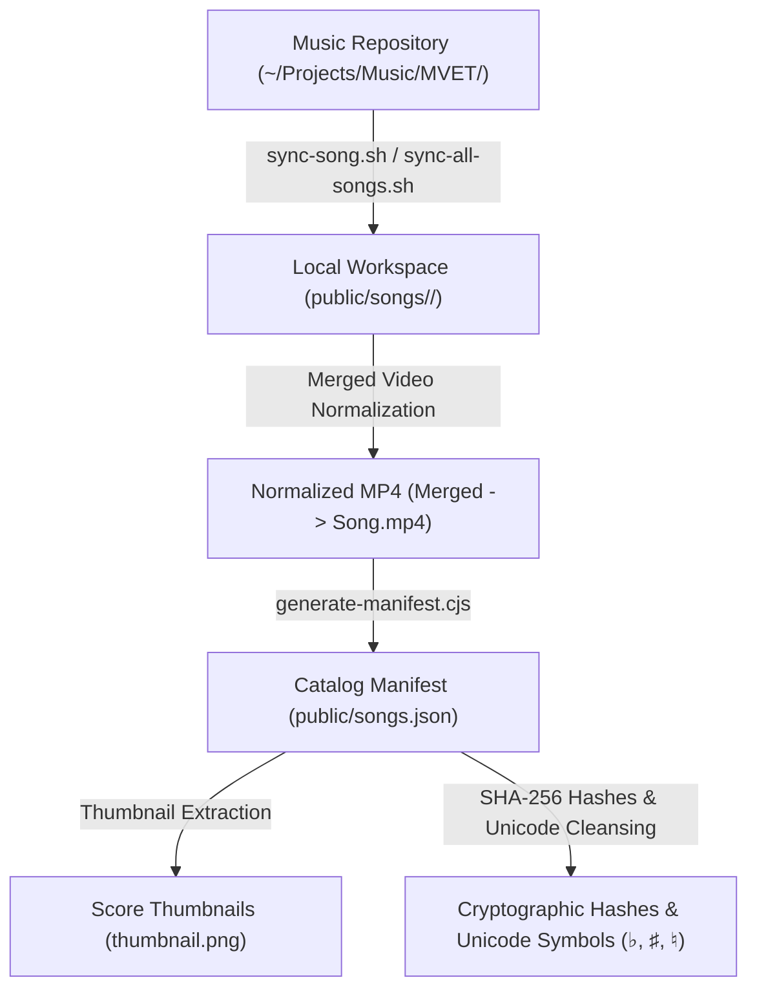

# Skill: Song Catalog & Ingestion Management

This skill automates the ingestion, audio-visual normalization, metadata extraction, cryptographic integrity hashing, and manifest generation for all choral arrangements in the **MVET Songbook**.

---

## 1. Skill Capabilities & Workflow



---

## 2. Ingestion Pipeline

### Sync a Single Song
To ingest or update a specific song arrangement from `~/Projects/Music/MVET/<SongID>` into `public/songs/<SongID>`:
```bash
bash .agents/skills/song-catalog-management/scripts/sync-song.sh <Song_ID>
```
*Example*:
```bash
bash .agents/skills/song-catalog-management/scripts/sync-song.sh Battle_Hymn_of_the_Republic
```

**Actions Performed**:
1. Synchronizes SATB PDF score, MusicXML (`.mxl`), MuseScore (`.mscz`), audio (`.flac`, `.mp3`), and video (`.mp4`) files.
2. Excludes unneeded master files (`*(Master)*`).
3. **Merged Video Normalization**: Detects `<SongID>-Merged.mp4` (direct-stream-copied synchronized AV) and automatically replaces `<SongID>.mp4` with the merged file to prevent AV desync.

### Sync All Repertoire Songs
To bulk-synchronize all active arrangements:
```bash
bash .agents/skills/song-catalog-management/scripts/sync-all-songs.sh
```

---

## 3. Catalog Manifest & Hash Generation

After syncing assets, rebuild the catalog manifest:
```bash
node .agents/skills/song-catalog-management/scripts/generate-manifest.cjs
# Or via npm shortcut:
npm run generate-manifest
```

### What `generate-manifest.cjs` Does:
1. **Metadata Parsing**:
   - Inspects MusicXML (`.mxl`) and MuseScore (`.mscz`) files to extract title, subtitle, composer, arranger, engraver, key signature, and copyright info.
2. **Music Notation Unicode Compliance**:
   - Automatically sanitizes and replaces ASCII letters (`b`, `#`, `n`) with official music notation Unicode equivalents:
     - Flat `♭` (`U+266D`)
     - Sharp `♯` (`U+266F`)
     - Natural `♮` (`U+266E`)
3. **Part Discovery**:
   - Discovers practice tracks (`soprano`, `alto`, `tenor`, `bass`, `women`, `men`, `instrumental`).
4. **Thumbnail Generation**:
   - Extracts embedded score cover thumbnails from `.mscz` or generates them if missing.
5. **SHA-256 Integrity Hashes**:
   - Calculates cryptographic SHA-256 checksums for every score, audio, video, and thumbnail file for deterministic cache invalidation (`?v=<hash>`).
6. **Outputs**:
   - Writes `public/songs.json` and updates sidecar `song.json` in each song directory.

---

## 4. Scripts Inventory

| Script | Purpose |
|:---|:---|
| [`scripts/sync-song.sh`](file:///home/chuck/Projects/www/MVET_Songbook/.agents/skills/song-catalog-management/scripts/sync-song.sh) | Ingests a single song package with merged video normalization |
| [`scripts/sync-all-songs.sh`](file:///home/chuck/Projects/www/MVET_Songbook/.agents/skills/song-catalog-management/scripts/sync-all-songs.sh) | Batch ingests all song packages in the choral repertoire |
| [`scripts/generate-manifest.cjs`](file:///home/chuck/Projects/www/MVET_Songbook/.agents/skills/song-catalog-management/scripts/generate-manifest.cjs) | Generates `public/songs.json` with metadata, Unicode music symbols, thumbnails, and SHA-256 hashes |
