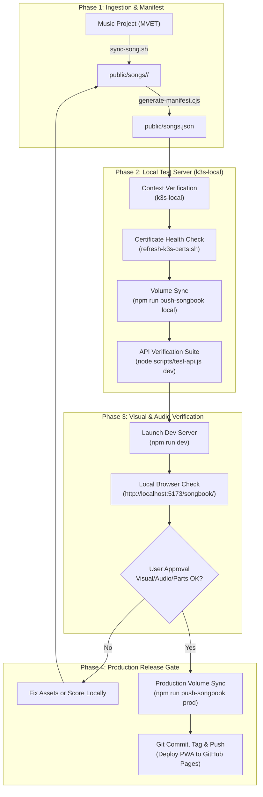

# Workflow: Song Ingestion, Local Testing & Deployment Pipeline

This document defines the strict standard operating procedure (SOP) for adding songs to the MVET Songbook, testing against the local Kubernetes instance (`k3s-local`), and deploying to production (`vps-production`).

---

## Workflow Diagram



---

## Preflight Checklist

Before starting any deployment cycle:
- [ ] Working directory is `/home/chuck/Projects/www/MVET_Songbook`.
- [ ] Active kubectl context is `k3s-local` (`kubectl config current-context`).
- [ ] `k3s-local` client certificates are healthy (`bash .agents/skills/local-testing-and-deployment/scripts/refresh-k3s-certs.sh --check-only`).
- [ ] Local K3s API pod is running (`kubectl get pods -n mvet-songbook`).

---

## Detailed Step-by-Step Procedure

### 1. Ingest Assets from Music Project
```bash
# Sync specific song:
bash scripts/sync-song.sh Battle_Hymn_of_the_Republic

# Ensure it is included in scripts/sync-all-songs.sh song_ids list
```

### 2. Generate Manifest and Checksum Hashes
```bash
node scripts/generate-manifest.cjs
```

### 3. Sync to Local HostPath Storage
```bash
npm run push-songbook local
# Target volume: /var/data/mvet-songbook
```

### 4. Execute Local API Integration Tests
```bash
node scripts/test-api.js dev
# Target URL: http://mvet-api.test
# Expected: 16/16 checkpoints pass (100%)
```

### 5. Verify Interactivity in Local Browser
```bash
npm run dev
```
Navigate to `http://localhost:5173/songbook/` in the browser and test:
* [ ] Score rendering and typography
* [ ] Audio playback and continuous scrolling
* [ ] Part isolation (S, A, T, B, SATB)
* [ ] Gated download buttons (MSCZ, MXL, PDF)

### 6. Production Deployment (Strictly Gated)
**DO NOT RUN THIS STEP WITHOUT USER APPROVAL.**
```bash
# Push song files to VPS:
npm run push-songbook prod

# If API code was modified:
npm run deploy-prod-api

# Commit and trigger GitHub Actions build:
git add .
git commit -m "feat(catalog): add Battle Hymn of the Republic"
npm run bump:minor
git push origin main --tags
```
