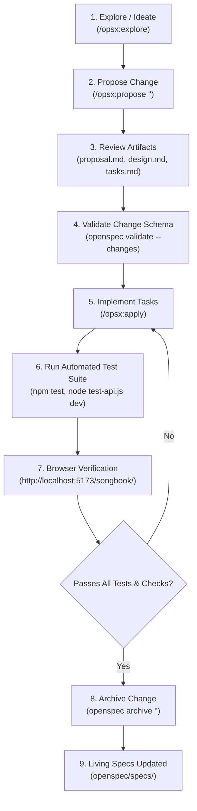

# Workflow: OpenSpec Spec-Driven Change Lifecycle

This workflow defines the standard process for proposing, developing, verifying, and archiving changes in the MVET Songbook using the OpenSpec CLI toolchain.

---

## Change Lifecycle Overview



---

## Step-by-Step Procedure

### Step 1: Propose a Change
When introducing a new feature, modifying architectural behavior, or refactoring code:
```bash
# In chat / terminal:
/opsx:propose "my-change-name"
```
This generates the proposal artifacts in `openspec/changes/<name>/`:
* `proposal.md`: Why the change is being made and the problem being addressed.
* `design.md`: Technical approach, architecture, and tradeoffs.
* `specs/`: Deltas to the affected domain specifications.
* `tasks.md`: Atomic checklist of implementation steps.

### Step 2: Validate the Proposal Artifacts
Before touching application code, verify that the proposal conforms to OpenSpec schemas:
```bash
openspec validate --changes
```

### Step 3: Implement Tasks
Execute the implementation tasks sequentially:
```bash
/opsx:apply
```
Work through each task in `tasks.md`, checking them off as they are implemented.

### Step 4: Run Verification Tests
Verify that code changes fulfill both the technical tests and the living specifications:
```bash
# 1. OpenSpec validation:
openspec validate --all

# 2. Code linting and production build:
npm run lint && npm run build

# 3. Local API integration test runner:
node scripts/test-api.js dev
```

### Step 5: Archive the Change
Once implementation and verification are complete, archive the change:
```bash
openspec archive "<name>"
```
This automatically:
1. Merges the proposal's delta specs into the living specifications under `openspec/specs/`.
2. Moves the change directory into `openspec/changes/archive/<date>-<name>/`.
3. Ensures `openspec/specs/` remains the current, up-to-date source of truth.
