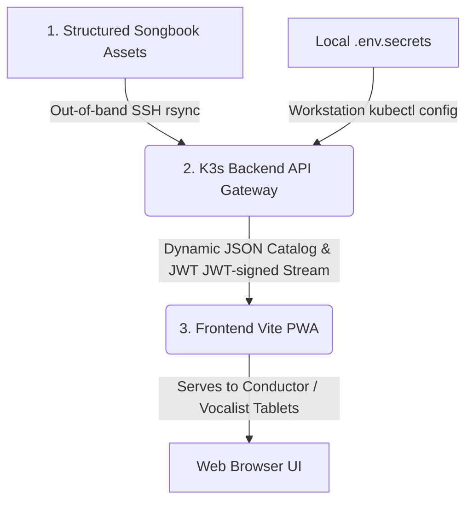

# MVET Songbook – Design Philosophy & Architecture

This document outlines the design decisions and architectural rationale behind the MVET Songbook Rehearsal Suite. It serves as a guide for understanding the "Why" behind the "What."

---

## 1. Three-Tier Architectural Vision

To comply with licensing and DMCA requirements while delivering a modern, responsive user experience on client mobile and tablet screens, the platform is divided into three cleanly isolated tiers:

1. **Structured Songbook Assets & Database (Private)**
   - Resides securely in local directory structures on the server nodes, mounted as standard Kubernetes persistent volumes (`hostPath` pointing to `/var/data/mvet-songbook`).
   - Syncs out-of-band directly from the editor's workstation to bypass Git history size limits and maintain 100% private copyright compliance.
2. **Stateless API Gateway Container (Secure Logic)**
   - Houses the express-routing logic, OpenAPI descriptors, cryptographic token checks, and media streaming middleware.
   - Containerized and published securely on GitHub Container Registry (GHCR) as `ghcr.io/chuck650/mvet-api:latest`. 
   - Excludes all musical files, enabling 100% open-source security compliance.
3. **Frontend PWA Client (Public Presentation)**
   - A static Single Page Application (SPA) built using Vite + React.
   - Deployed directly to GitHub Pages, utilizing local caching via IndexedDB and Service Workers to achieve high responsiveness and offline reliability.

---

## 2. Key Architectural Decisions

### 2.1 The "Pre-rendered Sync" Strategy
Early versions explored real-time browser-side synchronization between the score and audio (using custom timing maps and cursor loops). This was completely abandoned and deprecated in favor of **MuseScore 4.7 Video Exports**.
- **Rationale**: Browser-side sync is fragile across different hardware/browser combinations. Pre-rendering the score-tracking "playhead" into an MP4 video file guarantees 100% synchronization accuracy natively within the browser's video player, with zero CPU overhead for the client. As a result, all `timing.json` map generations were purged from the build process.

### 2.2 Web Audio API over HTML5 Audio
We chose the **Web Audio API** for rehearsal track playback.
- **Rationale**: Native `<audio>` tags provide limited control over the underlying audio buffer. The Web Audio API allows us to force a specific sample rate (48kHz), implement high-resolution metering (Equalizer), and execute a **Network-Aware Auto-Play** architecture that triggers playback immediately upon decoding, preventing the latency or "seeking" issues common in standard audio elements.

### 2.3 The Sidecar Manifest Pattern (Split-Role Architecture)
Each song directory contains a `song.json` sidecar that maps file roles (PDF, MP4, etc.) to actual filenames. We utilize a **Split-Role Architecture** for MusicXML.
- **Rationale**: This allows for human-curated file management while supporting automated build-time manifest generation. By splitting the MusicXML roles into `"mxl"` (for raw file downloads) and `"osmd"` (for the visual rendering engine, usually set to a `*-SATB.mxl` conductor layout), we maintain strict control over both the visual layout and the downloadable payloads without forcing strict naming conventions on the user.

### 2.4 Containerized API Gateway & Dynamic Obfuscation Layer
To comply with intellectual property regulations without compromising PWA performance, we transitioned the application to a secured hybrid delivery pipeline using a containerized Express API gateway.
- **Dynamic Masking**: For unauthenticated guests, the catalog endpoint (`GET /api/songs`) dynamically strips high-fidelity asset paths and hashes for copyrighted arrangements (like "Armed Forces Medley"), returning `{ protected: true }` placeholders. Public domain metadata remains completely transparent.
- **Pre-Shared Key & JWT Session Lifecycle**: Choir members submit an access key which is exchanged at `POST /api/auth/token` for a cryptographically signed JWT, granting 90-day access to full vocal arrangements.
- **Service Worker Authorization Injection**: Since standard HTML5 tags (like `<audio>` or `<video>`) do not support custom request headers, a browser-side Service Worker intercepts all file requests to the API and dynamically appends the JWT `Authorization: Bearer <token>` header, facilitating seamless native streaming and background offline caching.
- **Public Image Path-Bypass**: Image extensions (`png`, `jpg`, etc.) bypass the authentication middleware completely, enabling anonymous visitors to view the catalog grid's song thumbnails without encountering broken assets.

### 2.6 Cloud-Native TLS Termination (Option A)
Rather than routing public API requests through the host machine's global Nginx reverse proxy, we decided to handle secure TLS termination natively inside the Kubernetes cluster via Traefik and Let's Encrypt (`cert-manager`).
- **Rationale**:
  1. **Strict Isolation**: It keeps 100% of the MVET API's network, ingress, and SSL certificate resources fully encapsulated inside Kubernetes under the `mvet-songbook` namespace. This prevents any modifications to the host Nginx configuration that could risk disrupting existing host-hosted websites (like `www.cminfosec.com` or `mail.cminfosec.com`).
  2. **Automated Lifecycle**: Using K3s's native Traefik controller and `cert-manager` allows us to automate certificate issuance and 90-day renewals using Let's Encrypt HTTP-01 challenges completely transparently within the cluster boundaries.
- **Wireguard Coexistence**: Because Klipper LoadBalancer binds the `mvet-api-ingress-prod` directly to the public interface `83.229.67.95:443`, public HTTPS traffic routes straight into Traefik. Wireguard tunnel connections (targeting the private host IP `10.51.51.7`) bypass this and resolve through Nginx over Wireguard, keeping the environments clean and isolated.

### 2.7 Out-of-Band SSH Delta Synchronization
To push over a gigabyte of vocal media files, standard file transfers via the Kubernetes API (`kubectl cp`) were abandoned in favor of native **SSH delta rsync**.
- **Rationale**: `kubectl cp` bundles directories into a tarball on the fly, offering no incremental diffing, resuming, or transfer efficiency. By configuring our production script to connect via the local `~/.ssh/config` `vps` host, we ensure that:
  1. Directories and permissions are established natively via remote SSH commands.
  2. Large video/audio sync is delta-optimized, taking milliseconds for minor changes rather than hours of full uploads.

---

## 3. Visual Language & UX

### 3.1 Patriotic Glassmorphism
The aesthetic uses deep navy backgrounds (`#0f172a`) with sky blue accents (`#38bdf8`) and translucent "glass" borders.
- **Rationale**: This creates a modern, premium feel that honors the veteran focus without relying on generic patriotic tropes. The high-contrast elements ensure accessibility for older eyes.

### 3.2 The "Golden Ratio" Centering
We discovered that OSMD SVGs are inherently asymmetric due to part label positioning.
- **Rationale**: To center the score on the virtual "paper" container, we apply an asymmetric margin split (**2.0 Left / 10.0 Right**). This compensates for the implicit label space and ensures the staves are visually centered in the container.

### 3.3 Performance Mode (86vh Atomic Vertical Fit)
A dedicated "Performance Mode" was built specifically for tablet and mobile landscape use during live performances.
- **Rationale**: Rendering long SVG documents on mobile browsers can cause vertical scrolling tears or zooming issues. By establishing an "Infinite Canvas" with an exact `86vh` vertical constraint, the score securely locks to the screen bounds without scrolling, while custom on-screen gesture areas provide safe page-turning.

---

## 4. Caching & Reliability

### 4.1 Surgical SHA-256 Sync
The build script generates a unique SHA-256 hash for every asset.
- **Rationale**: Browser caching is often unreliable (especially on Edge or mobile WebView). By appending the hash to every URL (`path?v=[hash]`), we bypass stale caches and guarantee that a corrected audio track or score is immediately available to the user after a build.

### 4.2 Network-First Manifest
The `songs.json` manifest is fetched with a timestamp to force a network check on every app load.
- **Rationale**: This ensures the client always has the latest "Source of Truth" for hashes and metadata before deciding which local files to use.

---

## 5. Development Workflow
This project utilizes an **Agent-Driven Development** model.
- **Rationale**: By maintaining structured documentation (OpenSpec, Design Docs), autonomous agents can verify the codebase against established standards, perform regression testing, and evolve features with high consistency.

---
*Last Updated: 2026-05-26 (v1.2.53)*
