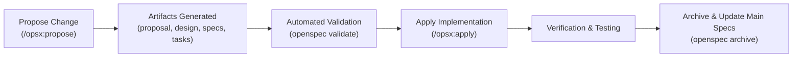

# OpenSpec: MVET Songbook Rehearsal Suite

This document serves as the master index for the **OpenSpec** AI-native spec-driven development system in the MVET Songbook repository.

OpenSpec provides schema-validated, living specifications and change proposals governed by the OpenSpec CLI toolchain (`/usr/local/bin/openspec`, version 1.2.0).

---

## 📑 Living Specifications Directory (`openspec/specs/`)

The living architecture, security, and rendering contracts are maintained in modular, RFC 2119-compliant specifications under `openspec/specs/`:

| Specification | Path | Description & Scope |
|:---|:---|:---|
| **System Architecture** | [`openspec/specs/architecture/spec.md`](file:///home/chuck/Projects/www/MVET_Songbook/openspec/specs/architecture/spec.md) | Decoupled PWA & Express API tier, Traefik ingress, K3s/VPS environments, pre-production gates. |
| **Authentication & Access** | [`openspec/specs/auth/spec.md`](file:///home/chuck/Projects/www/MVET_Songbook/openspec/specs/auth/spec.md) | UUIDv4 Pre-Shared Key (PSK) token exchange, JWT claims, Service Worker header injection, catalog obfuscation. |
| **Score Rendering** | [`openspec/specs/score-rendering/spec.md`](file:///home/chuck/Projects/www/MVET_Songbook/openspec/specs/score-rendering/spec.md) | OpenSheetMusicDisplay (OSMD) configuration, symmetric margins, and the Smart Part Names & Abbreviations standard. |
| **Audio & Sync** | [`openspec/specs/audio-sync/spec.md`](file:///home/chuck/Projects/www/MVET_Songbook/openspec/specs/audio-sync/spec.md) | Native Web Audio API (`AudioContext`), note-level cursor synchronization, buffer scheduling, performance mode scroller. |
| **Catalog & Ingestion** | [`openspec/specs/catalog/spec.md`](file:///home/chuck/Projects/www/MVET_Songbook/openspec/specs/catalog/spec.md) | Song asset layout, SHA-256 integrity hashes, thumbnail creation, and `songs.json` manifest generation. |

---

## 🛠️ OpenSpec CLI Tooling & Validation

The OpenSpec toolchain provides automated validation, change lifecycle management, and artifact tracking.

### 1. Validate All Specifications
```bash
openspec validate --specs
```

### 2. Inspect an Individual Specification
```bash
openspec show <spec-id>
# e.g., openspec show score-rendering
```

### 3. List All Living Specifications
```bash
openspec list --specs
```

---

## 🔄 Spec-Driven Change Lifecycle

When designing, proposing, or applying structural changes to MVET Songbook, developers and AI pair programmers follow the OpenSpec change workflow:



### Slash Commands & Workflows
* **`/opsx:propose "<name>"`**: Creates a new change proposal directory under `openspec/changes/<name>/` with `proposal.md`, `design.md`, delta `specs/`, and `tasks.md`.
* **`/opsx:apply`**: Sequentially implements the tasks defined in `tasks.md`.
* **`/opsx:archive "<name>"`**: Merges completed change deltas into `openspec/specs/` and archives the proposal in `openspec/changes/archive/`.
* **`/opsx:explore`**: Explores design alternatives and technical options prior to drafting a formal proposal.
