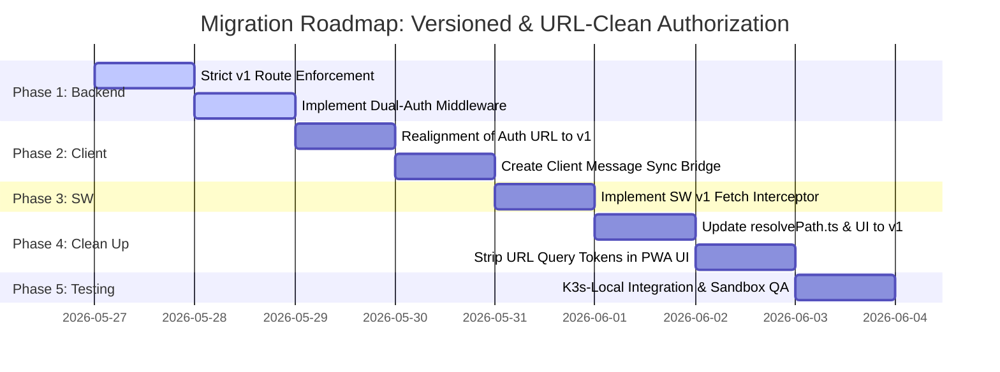

# Implementation Plan: Service Worker Token Authorization

This document presents the step-by-step technical implementation plan to migrate the **MVET Songbook Rehearsal Suite** from query-parameter URL tokens to secure, header-based **Service Worker Token Authorization**.

---

## 📅 Implementation Phasin



---

## 🛠️ Detailed Steps by Phase

### Phase 1: Backend Express API Hardening & Strict v1 Route Enforcement

To eliminate the architectural oversight of unversioned routes (following RESTful URL best practices from https://restfulapi.net/versioning/), we will restrict all backend routing strictly to the `/api/v1/` URI namespace.

- **Target File**: `api/src/index.ts`
- **Tasks**:
  1.  **Deprecate Unversioned Mount**: Delete the legacy base route mounting:
      - _Delete_: `app.use('/api', apiRouter);`
      - _Keep Only_: `app.use('/api/v1', apiRouter);`
        This immediately breaks any unversioned `/api/songs` requests with standard HTTP `404 Not Found`, forcing all clients to follow the versioning specification.
  2.  **Refactor Dual-Auth Middleware**: Modify `authenticateToken` within the versioned context to extract the token in order of priority:
      - **Standard**: `Authorization: Bearer <token>` HTTP header.
      - **Legacy fallback**: `?token=<token>` query string parameter (kept active only during the local migration window, then deprecated).

---

### Phase 2: PWA Client Auth Realignment & Message Sync Bridge

Establish strict versioning on our client-side auth transactions and build the PWA-to-Service Worker message channel.

- **Target Files**: `src/hooks/useSongbookAuth.ts` and `src/utils/authSync.ts` (New file)
- **Tasks**:
  1.  **Auth v1 Update**: Update `useSongbookAuth.ts` endpoints to reference versioned paths:
      - _Before_: `${API_BASE}/api/auth/token`
      - _After_: `${API_BASE}/api/v1/auth/token`
  2.  **Create Message Bridge**: Create `src/utils/authSync.ts` containing the `syncTokenToServiceWorker(token)` method. This utility waits for `navigator.serviceWorker.ready` and broadcasts the `SET_AUTH_TOKEN` payload down to the background worker.
  3.  **Integrate Handlers**: Connect this sync bridge to the app lifecycle:
      - **On PWA Startup**: Read local JWT (from `localStorage` or `IndexedDB`) and sync it to the Service Worker.
      - **On Login**: Sync the fresh JWT.
      - **On Logout**: Sync `null` to wipe credentials instantly.

---

### Phase 3: Workbox Service Worker Interception

Configure the Service Worker to intercept requests and inject headers dynamically, matching only the strict versioned URL base.

- **Target File**: `src/sw.js` (or Vite PWA service worker entry point)
- **Tasks**:
  1.  Add a `message` event handler to store the active token in the Service Worker's memory scope.
  2.  Add a `fetch` event listener to intercept all requests directed to **`/api/v1/songs/.../files/`**.
  3.  Within the `fetch` interceptor:
      - **Cache Match Check**: Query standard `caches.match(event.request)`.
        - _Cache Hit_: Return the stored file instantly. No network query is made.
        - _Cache Miss_: Proceed to network fetch.
      - **Request Cloning & Header Injection**: Construct a `new Request` using the versioned URL, copying existing headers and setting `Authorization: Bearer <token>`.
      - **Network Request**: Fetch the modified request from the API gateway.
      - **Cache Storage Write**: Store the unencrypted payload returned from the API inside the local PWA Cache under the versioned URL.
      - **Cache Housekeeping**: Search the local cache and delete any old version hashes (`?v=old_hash`) for this specific song asset to prevent duplicate local storage waste.

---

### Phase 4: Client URL Versioning & Clean Up

Clean all remaining paths inside the frontend application to point exclusively to the `/api/v1/` base path and strip credentials.

- **Target Files**: `src/utils/resolvePath.ts`, `src/songbook/App.tsx`, and `src/songbook/SettingsView.tsx`
- **Tasks**:
  1.  **Resolve Path Update**: Refactor `src/utils/resolvePath.ts` to construct the versioned path:
      - _Before_: `${cleanApiBase}/api/songs/...`
      - _After_: `${cleanApiBase}/api/v1/songs/...`
  2.  **App & Settings Realignment**: Refactor catalog fetch URLs in `App.tsx` and `SettingsView.tsx` to call `${apiBase}/api/v1/songs` instead of `/api/songs`.
  3.  **UI URL Parameter Clean Up**: Refactor `getSongFileUrl` in `App.tsx` to construct the request path containing **only the static version hash** mapping from the catalog manifest:
      - _Before_: `/api/v1/songs/Medley/files/pdf?token=eyJ...&v=sha256`
      - _After_: `/api/v1/songs/Medley/files/pdf?v=sha256`
  4.  Verify that all downstream button callbacks, PDF iframes, and Audio source targets receive this clean, versioned URL.

---

### Phase 5: Verification, Local Testing & Version Gating

Before promotion to the VPS production context, the entire flow must be validated within our isolated local Sandbox.

1.  **Test Runner Re-alignment**:
    Update the integration test suite runner (`scripts/test-api.js`) to target the versioned `/api/v1/` routes exclusively.
2.  **Verify Strict Version Gating**:
    Execute an integration check against unversioned `/api/songs` directly. Confirm that the API Gateway returns a `404 Not Found` response, proving the legacy route base is successfully stripped.
3.  **TypeScript & Lint Verification**:
    Run lint checks to ensure no type conflicts or floating promises are introduced in the Workbox interfaces:
    ```bash
    npm run lint
    ```
4.  **Local Container compilation**:
    Build the new Express API gateway and import it to the local containerd registry:
    ```bash
    npm run build-api
    ```
5.  **Local Dev Deployment**:
    Deploy the API deployment to the `k3s-local` namespace:
    ```bash
    npm run deploy-api
    ```
6.  **Integration Testing**:
    Execute the integration test runner to verify header authentication:
    ```bash
    node scripts/test-api.js dev <preshared-key>
    ```
7.  **Browser Verification (Network Panel)**:
    Open the local Vite dev server, log in, open the inline PDF, play an audio track, and inspect the browser developer tools:
    - Confirm that all request paths start strictly with `/api/v1/`.
    - Confirm that the `Request URL` in the Network tab contains **zero tokens**.
    - Confirm that the outgoing request contains the standard `Authorization: Bearer <token>` header.
    - Confirm that disabling internet access (Offline Mode) successfully serves cached PDFs and audio tracks instantly.

---

## 📈 Security Status Board (Target State)

Once this migration is complete, the MVET Songbook will achieve the highest possible static PWA security standard:

- [x] Stateless Gateway Boundary
- [x] Local Storage/IndexedDB Persistence
- [x] Standard Bearer Header Authentication
- [x] Dynamic Fetch Interception for Native Tags
- [x] Zero plain-text credentials logged in Ingress/Traefik
- [x] Zero tokens recorded in browser history databases
- [x] Zero token exposure in public HTML iframe / audio markup
