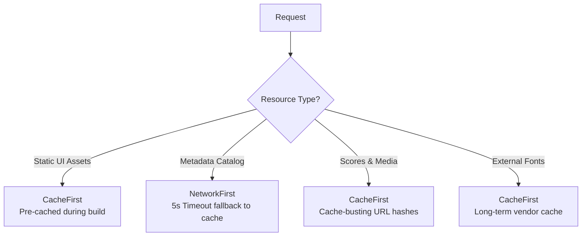

# Technical Guide: Caching Strategies

This guide describes the caching architecture, strategies, and implementation details for the Military Voices of East Tennessee (MVET) Choral Songbook PWA. It outlines how we balance instant load times, offline reliability, and content freshness.

---

## 1. Caching Philosophy & Goals

The MVET Choral Songbook is designed to be used in rehearsal spaces, concert halls, and travel locations where internet connectivity is often poor, flaky, or non-existent (including "Lie-Fi" conditions where the device shows connection bars but transfers no data). 

Our primary caching goals are:
* **Offline Functionality:** Complete access to sheet music files (PDF, MXL, MSCZ), audio files (MP3, FLAC), and video files (MP4) once they have been synced.
* **Instantaneous Loading:** Near-zero retrieval latency (<5ms) for previously loaded or cached resources.
* **Guaranteed Content Integrity:** Ensuring that any updates made to score arrangements on the server are immediately reflected on user devices without stale cache interference.

---

## 2. Resource Caching Strategies

We categorize the application's network requests into four distinct tiers, each utilizing an optimized Workbox caching strategy.

### A. Dynamic Catalog Metadata (`manifest-cache`)
* **Target Files:** `/songs.json`, `/api/v1/songs`
* **Strategy:** `NetworkFirst` with a **5-second timeout**
* **Rationale:** The catalog acts as the index database of all song metadata. We always want users to see the latest song library if they have a working connection. However, if they are on a slow/flaky connection (Lie-Fi), we do not want the app to hang indefinitely. By enforcing a 5-second `networkTimeoutSeconds` limit, the service worker will quickly abort the network wait and fallback to the cached local catalog version.

### B. Scores & Media Assets (`song-files-cache`, `audio-cache`, `video-cache`)
* **Target Files:** `.pdf`, `.mxl`, `.mscz`, `.mp3`, `.flac`, `.mp4`
* **Strategy:** `CacheFirst`
* **Rationale:** Score files and rehearsal tracks are large assets. Re-fetching them over the network on every load is highly inefficient. 
* **Cache Safety (Cache-Busting Hashes):** We use a strict version-locking scheme. Every file asset in the catalog is appended with a SHA-256 hash parameter (`?v=hash`). Because any update to a score file on the server results in a new hash, the request URL changes. This acts as an automatic cache miss, forcing the Service Worker to fetch the updated file from the network and store it, while unchanged files continue to load instantly from the cache.
* **Media Seekability:** For audio/video caches, Workbox's `RangeRequests` plugin is enabled. This allows the HTML5 media player to perform range requests (e.g., seeking/scrubbing through rehearsal tracks) directly from the cached blob data.

### C. Static App Shell & Assets
* **Target Files:** Vite bundle assets (`.js`, `.css`, UI `.svg` icons, favicon)
* **Strategy:** Pre-cached during application compilation (`globPatterns` in VitePWA)
* **Rationale:** Pre-caching ensures that the PWA skeleton loads instantly offline, serving as the baseline shell for the client-side routes.

### D. External Dependencies (`google-fonts-cache`)
* **Target Files:** Google Fonts (`fonts.googleapis.com`)
* **Strategy:** `CacheFirst` (with a 1-year expiration policy)
* **Rationale:** These font files are external and immutable. Storing them long-term prevents unnecessary cross-origin requests.

---

## 3. Offline Mode UI Integration

To keep users informed of their connection state without introducing visual distractions that could pull attention away from choral sheet music, the application implements static visual status badges.

### A. Library View
* **Location:** Top-right corner of the library viewport header.
* **Trigger:** Native browser connection listeners (`online` / `offline` events).
* **Aesthetic:** A subtle, glassmorphic red/crimson pill labeled `OFFLINE` with no animations to prevent visual noise.

### B. Song Viewer View
* **Location:** Far-right corner of the fixed bottom viewer footer.
* **Trigger:** Inherited offline state prop.
* **Aesthetic:** A matching static badge placed at the absolute-right position of the footer, preserving the centering of the main arrangement metadata.

---

## 4. Architectural Alternatives Evaluated

### WebAssembly (WASM) in the Service Worker
During design phases, we analyzed whether moving network-routing or service worker authentication logic to a Rust-compiled WebAssembly module would yield performance benefits.

**We rejected this approach due to three fatal overheads:**
1. **No Direct DOM/Web Access:** WASM cannot access Cache Storage, IndexedDB, or the `fetch` API directly. It must marshal data across the JavaScript-to-WASM boundary, introducing severe serialization overhead for binary streams.
2. **Startup Blockers:** Loading and compiling the WASM binary on Service Worker boot adds critical latency to the boot path, delaying the interception of the very first asset request.
3. **Bundle Size Bloat:** A Rust/WASM binary significantly inflates the initial app download footprint.

Consequently, caching routing logic remains in standard JavaScript using Workbox, keeping the service worker process fast, lightweight, and responsive.
