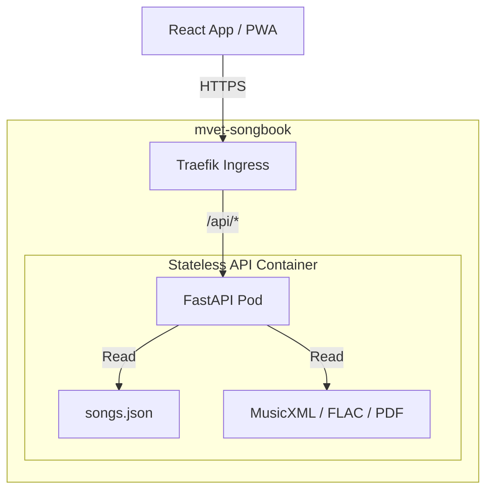

# Technical Guide: k3s MusicXML Access Control Implementation Blueprint

This guide is the authoritative technical blueprint and implementation manual for introducing secure, role-based access control to the **MVET Songbook** library (`chuck650/MVET_Songbook`) on a `k3s` production VPS environment. 

This document serves as direct, step-by-step instructions for the **Antigravity AI Agent** operating inside the `MVET_Songbook` React repository to implement the backend API, the container build pipelines, and the frontend integrations.

---

## 1. Architectural Overview & Security Model

The system utilizes a stateless, high-performance container serving both metadata and static music files. Access control is based on a zero-database **Overlapping Preshared Key (PSK) to JSON Web Token (JWT)** exchange.



### Key Lifecycle & Access Rules
- **Public Domain Songs (`copyrighted == false`):** Accessible anonymously without headers.
- **Copyrighted Songs (`copyrighted == true`):** Requires an `Authorization: Bearer <JWT>` HTTP header.
- **End-User Flow:** Users enter the active choir PSK once. The React app exchanges it for a 90-day JWT cryptographically signed by the backend. The JWT is saved in `localStorage` and sent transparently. End users never manage the JWT directly.
- **Overlapping Key Rotation:** The API accepts a comma-separated list of active PSKs (e.g., primary and secondary). During rotation, you declare the new keys in your Git repository. The CI/CD pipeline deploys them via Kubernetes Secrets, which triggers a zero-downtime rolling restart of your pods. Already-issued JWTs remain valid until their expiration, providing a perfectly seamless transition.

---

## 2. Backend API Implementation (FastAPI)

Below is the complete, production-ready Python FastAPI codebase. 

### A. Requirements (`requirements.txt`)
```text
fastapi==0.110.0
uvicorn==0.28.0
PyJWT==2.8.0
pydantic==2.6.4
```

### B. API Server Source (`app/main.py`)
```python
import os
import json
from typing import List, Optional
from datetime import datetime, timedelta, timezone
from fastapi import FastAPI, Depends, HTTPException, Header, status
from fastapi.middleware.cors import CORSMiddleware
from fastapi.responses import FileResponse
from pydantic import BaseModel
import jwt

app = FastAPI(
    title="MVET Songbook API",
    description="Stateless MusicXML and Audio Access Control Gateway",
    version="1.0.0",
    docs_url="/docs",
    redoc_url="/redoc"
)

# CORS Configuration
CORS_ORIGINS = os.getenv("CORS_ORIGINS", "*").split(",")
app.add_middleware(
    CORSMiddleware,
    allow_origins=CORS_ORIGINS,
    allow_credentials=True,
    allow_methods=["*"],
    allow_headers=["*"],
)

# Configuration Variables
JWT_SECRET = os.getenv("JWT_SECRET")
JWT_ALGORITHM = os.getenv("JWT_ALGORITHM", "HS256")
JWT_EXPIRATION_DAYS = int(os.getenv("JWT_EXPIRATION_DAYS", "90"))
SONGS_JSON_PATH = os.getenv("SONGS_JSON_PATH", "/app/songbook/songs.json")
SONGS_DIR = os.getenv("SONGS_DIR", "/app/songbook")

# Load PSKs from environment (comma-separated list)
def get_active_psks() -> List[str]:
    psks_raw = os.getenv("ACTIVE_PSKS", "")
    return [key.strip() for key in psks_raw.split(",") if key.strip()]

# In-Memory Cache for Metadata Catalog
_catalog_cache = None

def load_catalog():
    global _catalog_cache
    if _catalog_cache is not None:
        return _catalog_cache
    
    if not os.path.exists(SONGS_JSON_PATH):
        raise RuntimeError(f"Metadata catalog songs.json not found at {SONGS_JSON_PATH}")
        
    with open(SONGS_JSON_PATH, "r") as f:
        _catalog_cache = json.load(f)
    return _catalog_cache

# Schema Validation
class PSKRequest(BaseModel):
    psk: str

class TokenResponse(BaseModel):
    token: str
    expires_at: str

# Token Generation Helper
def generate_jwt() -> str:
    if not JWT_SECRET:
        raise HTTPException(
            status_code=status.HTTP_500_INTERNAL_SERVER_ERROR,
            detail="JWT Sign Secret is not configured on the server."
        )
    expire = datetime.now(timezone.utc) + timedelta(days=JWT_EXPIRATION_DAYS)
    payload = {
        "exp": expire,
        "iat": datetime.now(timezone.utc),
        "authorized": True
    }
    return jwt.encode(payload, JWT_SECRET, algorithm=JWT_ALGORITHM), expire.isoformat()

# JWT Verification Dependency
def verify_authorization(authorization: Optional[str] = Header(None)) -> bool:
    if not authorization or not authorization.startswith("Bearer "):
        raise HTTPException(
            status_code=status.HTTP_401_UNAUTHORIZED,
            detail="Missing or malformed Authorization header."
        )
    
    token = authorization.split(" ")[1]
    try:
        payload = jwt.decode(token, JWT_SECRET, algorithms=[JWT_ALGORITHM])
        if not payload.get("authorized"):
            raise HTTPException(
                status_code=status.HTTP_403_FORBIDDEN,
                detail="Token does not contain valid authorization claims."
            )
        return True
    except jwt.ExpiredSignatureError:
        raise HTTPException(
            status_code=status.HTTP_401_UNAUTHORIZED,
            detail="Authorization token has expired."
        )
    except jwt.InvalidTokenError:
        raise HTTPException(
            status_code=status.HTTP_401_UNAUTHORIZED,
            detail="Invalid authorization token."
        )

# Helper to locate songs in the catalog
def find_song_in_catalog(song_id: str):
    catalog = load_catalog()
    # Handle catalog being either a list or a dictionary of songs
    if isinstance(catalog, dict):
        return catalog.get(song_id)
    elif isinstance(catalog, list):
        for song in catalog:
            if song.get("id") == song_id:
                return song
    return None

# --- API Endpoints ---

@app.post("/api/auth/token", response_model=TokenResponse)
async def exchange_psk_for_token(req: PSKRequest):
    active_keys = get_active_psks()
    if not active_keys:
        raise HTTPException(
            status_code=status.HTTP_500_INTERNAL_SERVER_ERROR,
            detail="Active PSKs are not configured on the server."
        )
        
    if req.psk.strip() not in active_keys:
        raise HTTPException(
            status_code=status.HTTP_401_UNAUTHORIZED,
            detail="Invalid Preshared Key."
        )
        
    token, expires_at = generate_jwt()
    return TokenResponse(token=token, expires_at=expires_at)

@app.get("/api/songs")
async def get_songs_manifest(authorization: Optional[str] = Header(None)):
    """
    Returns the metadata manifest. If the requester is not authorized (no valid token),
    copyrighted files paths inside the manifest are masked or removed.
    """
    catalog = load_catalog()
    
    # Check if client has a valid token
    is_authorized = False
    if authorization and authorization.startswith("Bearer "):
        token = authorization.split(" ")[1]
        try:
            payload = jwt.decode(token, JWT_SECRET, algorithms=[JWT_ALGORITHM])
            if payload.get("authorized"):
                is_authorized = True
        except jwt.PyJWTError:
            pass

    # Process and sanitize manifest for unauthorized clients
    sanitized_catalog = []
    
    # Handle list-based catalog
    songs_iterable = catalog if isinstance(catalog, list) else catalog.values()
    
    for song in songs_iterable:
        song_copy = json.loads(json.dumps(song)) # Deep copy
        
        # If song is copyrighted and client is NOT authorized, hide private assets
        if song_copy.get("copyrighted", False) and not is_authorized:
            # Mask or remove private file fields
            if "files" in song_copy:
                # Keep metadata, but strip download links or flag them as protected
                song_copy["files"] = {
                    "protected": True,
                    "mtime": song_copy["files"].get("mtime", "")
                }
            if "parts" in song_copy:
                for part_name, part in song_copy["parts"].items():
                    if "files" in part:
                        part["files"] = {"protected": True}
        
        sanitized_catalog.append(song_copy)
        
    return sanitized_catalog

@app.get("/api/songs/{song_id}/files/{file_type}")
async def serve_song_file(song_id: str, file_type: str, authorization: Optional[str] = Header(None)):
    """
    Serves the specific music asset. Copyrighted assets strictly require JWT validation.
    """
    song = find_song_in_catalog(song_id)
    if not song:
        raise HTTPException(status_code=404, detail="Song not found in metadata.")
        
    is_copyrighted = song.get("copyrighted", False)
    
    # If copyrighted, validate token signature
    if is_copyrighted:
        verify_authorization(authorization)

    # Locate the target file relative to the container directory
    # Expected relative path inside songs.json, e.g., "songbook/Armed_Forces_Medley_72/Armed_Forces_Medley_72-SATB.flac"
    # We resolve it relative to /app
    file_rel_path = None
    
    # Traverse file fields
    if "files" in song and file_type in song["files"]:
        file_rel_path = song["files"][file_type]
    else:
        # Check inside parts (e.g. Soprano, Alto, etc.)
        for part in song.get("parts", {}).values():
            if "files" in part and file_type in part["files"]:
                file_rel_path = part["files"][file_type]
                break

    if not file_rel_path:
        raise HTTPException(status_code=404, detail=f"File type '{file_type}' not available for this song.")

    # Resolve full path inside container
    # Since synced files sit inside public/songbook/ in the React app, we mount them at /app/songbook/
    # If the relative path in songs.json is "songbook/Armed_Forces/Armed_Forces.flac", we strip "songbook/" prefix
    clean_rel_path = file_rel_path
    if file_rel_path.startswith("songbook/"):
        clean_rel_path = file_rel_path[len("songbook/"):]
        
    full_path = os.path.join(SONGS_DIR, clean_rel_path)
    
    if not os.path.exists(full_path) or os.path.isdir(full_path):
        raise HTTPException(status_code=404, detail=f"Asset file not found on disk: {clean_rel_path}")

    # Set aggressive cache controls for immutable media files
    headers = {
        "Cache-Control": "public, max-age=31536000, immutable"
    }
    
    return FileResponse(path=full_path, headers=headers)
```

---

## 3. Docker Pipeline Design

This Dockerfile is designed to be built directly within the `MVET_Songbook` React project's workspace, copying the statically exported scores from the `public/songbook/` subfolder at build time.

### A. Dockerfile (`Dockerfile`)
```dockerfile
FROM python:3.11-slim as builder

WORKDIR /app

# Install dependencies in a virtual environment
RUN python -m venv /opt/venv
ENV PATH="/opt/venv/bin:$PATH"

COPY requirements.txt .
RUN pip install --no-cache-dir -r requirements.txt

# --- Final Light Stage ---
FROM python:3.11-slim

WORKDIR /app

COPY --from=builder /opt/venv /opt/venv
ENV PATH="/opt/venv/bin:$PATH"

# Copy API Source Code
COPY app/ /app/app/

# Copy statically exported music files and manifest from React's public assets
# At build-time, you must specify the build context containing the synchronized assets
COPY public/songbook/ /app/songbook/
COPY public/songs.json /app/songbook/songs.json

# Environment Defaults
ENV CORS_ORIGINS="*"
ENV JWT_ALGORITHM="HS256"
ENV JWT_EXPIRATION_DAYS="90"
ENV SONGS_JSON_PATH="/app/songbook/songs.json"
ENV SONGS_DIR="/app/songbook"

EXPOSE 8000

CMD ["uvicorn", "app.main:app", "--host", "0.0.0.0", "--port", "8000"]
```

---

## 4. Kubernetes Deployment Specification (k3s)

The following manifest defines the deployment, service, ingress routing (Traefik), and configuration secrets on your `k3s` environment.

### A. `k3s-deployment.yaml`
```yaml
apiVersion: v1
kind: Namespace
metadata:
  name: mvet-songbook
---
apiVersion: v1
kind: Secret
metadata:
  name: mvet-auth-secrets
  namespace: mvet-songbook
type: Opaque
stringData:
  # Comma-separated list of active preshared keys (rotating / overlapping)
  ACTIVE_PSKS: "mvet-choir-2026-q3,mvet-choir-2026-q2"
  # Strong random key for JWT signing
  JWT_SECRET: "SUPER_SECRET_RANDOM_HMAC_KEY_CHANGE_ME_IN_PRODUCTION"
---
apiVersion: apps/v1
kind: Deployment
metadata:
  name: mvet-api
  namespace: mvet-songbook
spec:
  replicas: 1
  selector:
    matchLabels:
      app: mvet-api
  template:
    metadata:
      labels:
        app: mvet-api
      annotations:
        # Config hash dynamically injected by Ansible. Forces zero-downtime 
        # rolling updates automatically when the keys are updated.
        checksum/config: "f7a637a892b10a26d7c67bf3c76d29b0a1d6ea5"
    spec:
      containers:
      - name: api-server
        image: ghcr.io/chuck650/mvet-songbook-api:latest
        imagePullPolicy: Always
        env:
        - name: ACTIVE_PSKS
          valueFrom:
            secretKeyRef:
              name: mvet-auth-secrets
              key: ACTIVE_PSKS
        - name: JWT_SECRET
          valueFrom:
            secretKeyRef:
              name: mvet-auth-secrets
              key: JWT_SECRET
        - name: CORS_ORIGINS
          value: "https://songbook.nelson.fam,https://mvet.netlify.app"
        ports:
        - containerPort: 8000
        resources:
          limits:
            memory: 128Mi
            cpu: 200m
          requests:
            memory: 32Mi
            cpu: 50m
---
apiVersion: v1
kind: Service
metadata:
  name: mvet-api-svc
  namespace: mvet-songbook
spec:
  ports:
  - port: 80
    targetPort: 8000
  selector:
    app: mvet-api
---
apiVersion: traefik.containo.us/v1alpha1
kind: IngressRoute
metadata:
  name: mvet-api-ingress
  namespace: mvet-songbook
spec:
  entryPoints:
    - websecure
  routes:
  - match: Host(`api.songbook.nelson.fam`) && PathPrefix(`/api`)
    kind: Rule
    services:
    - name: mvet-api-svc
      port: 80
  tls:
    secretName: nelson-fam-cert # Bound to FreeIPA Intermediate Issuing CA
```

---

## 5. React Frontend Integration

To integrate access control into the PWA front-end without refactoring all `<audio>` players and download links, implement a **Service Worker Network Interceptor** alongside a simple React context hook.

### A. The Service Worker Interceptor (`src/sw-auth.js`)
Service Workers can intercept all fetch requests. If a request is headed to our protected API `/api/songs/` paths, the Service Worker automatically grabs the JWT from `localStorage` and appends it to the header.

```javascript
self.addEventListener('fetch', (event) => {
  const url = new URL(event.request.url);

  // Intercept requests directed to our song serving API
  if (url.pathname.includes('/api/songs/') && url.pathname.includes('/files/')) {
    event.respondWith(
      // Retrieve the token from Client storage
      clients.get(event.clientId).then((client) => {
        // Since localStorage is not directly available inside the SW scope,
        // we can either fetch it via client postMessage or query client storage.
        // Alternate reliable approach: Save token in IndexedDB from the React app, 
        // which IS fully accessible in Service Workers.
        return getJWTFromIndexedDB().then((token) => {
          if (!token) {
            // No token, forward request as-is (will return 401 if copyrighted)
            return fetch(event.request);
          }

          // Clone the request and inject the Authorization header
          const newHeaders = new Headers(event.request.headers);
          newHeaders.append('Authorization', `Bearer ${token}`);

          const authenticatedRequest = new Request(event.request, {
            headers: newHeaders,
            mode: 'cors'
          });

          return fetch(authenticatedRequest);
        });
      })
    );
  }
});

// Simple IndexedDB lookup utility
function getJWTFromIndexedDB() {
  return new Promise((resolve) => {
    const request = indexedDB.open("mvet-auth-db", 1);
    request.onupgradeneeded = (e) => {
      e.target.result.createObjectStore("auth", { keyPath: "key" });
    };
    request.onsuccess = (e) => {
      const db = e.target.result;
      const transaction = db.transaction("auth", "readonly");
      const store = transaction.objectStore("auth");
      const getReq = store.get("jwt");
      getReq.onsuccess = () => {
        resolve(getReq.result ? getReq.result.token : null);
      };
      getReq.onerror = () => resolve(null);
    };
    request.onerror = () => resolve(null);
  });
}
```

### B. React PSK Access Modal Hook (`src/hooks/useSongbookAuth.js`)
Use the following hook in React to check token validity and open the login dialog.

```javascript
import { useState, useEffect } from 'react';

// IndexedDB Helper to share token with Service Worker
const saveTokenToIDB = (token) => {
  const request = indexedDB.open("mvet-auth-db", 1);
  request.onsuccess = (e) => {
    const db = e.target.result;
    const transaction = db.transaction("auth", "readwrite");
    transaction.objectStore("auth").put({ key: "jwt", token });
  };
};

export const useSongbookAuth = (apiBaseUrl = "https://api.songbook.nelson.fam") => {
  const [isAuthenticated, setIsAuthenticated] = useState(false);
  const [showAuthModal, setShowAuthModal] = useState(false);
  const [error, setError] = useState("");

  useEffect(() => {
    const token = localStorage.getItem("mvet_jwt");
    const expires = localStorage.getItem("mvet_jwt_expires");
    
    if (token && expires && new Date(expires) > new Date()) {
      setIsAuthenticated(true);
    }
  }, []);

  const loginWithPSK = async (psk) => {
    setError("");
    try {
      const res = await fetch(`${apiBaseUrl}/api/auth/token`, {
        method: "POST",
        headers: { "Content-Type": "application/json" },
        body: JSON.stringify({ psk })
      });

      if (!res.ok) {
        throw new Error(res.status === 401 ? "Invalid Access Key" : "Server connection failure");
      }

      const data = await res.json();
      localStorage.setItem("mvet_jwt", data.token);
      localStorage.setItem("mvet_jwt_expires", data.expires_at);
      saveTokenToIDB(data.token);

      setIsAuthenticated(true);
      setShowAuthModal(false);
      return true;
    } catch (err) {
      setError(err.message);
      return false;
    }
  };

  const logout = () => {
    localStorage.removeItem("mvet_jwt");
    localStorage.removeItem("mvet_jwt_expires");
    setIsAuthenticated(false);
  };

  return {
    isAuthenticated,
    showAuthModal,
    setShowAuthModal,
    loginWithPSK,
    logout,
    error
  };
};
```

---

## 6. Guide for the Implementing Agent

When implementing this API in the `MVET_Songbook` React project repository, perform the following tasks:

1. **Bootstrap API Folder:** Create `requirements.txt` and `app/main.py` using the FastAPI code provided in Section 2.
2. **Setup Docker Context:** Create the `Dockerfile` in the root of the project. Modify your build/release actions or scripts to trigger `docker build` *after* the local scores are synced via `npm run sync`.
3. **Frontend Token Verification:**
   - Integrate the `useSongbookAuth` React hook in your main layout.
   - Build a glassmorphic password modal to capture the PSK whenever `showAuthModal` is triggered.
   - Set up the IndexedDB write routines on successful token return so that the Service Worker can authenticate media files.
4. **Service Worker Configuration:** Modify your active Service Worker bundle to load the interceptor code, ensuring all media assets requests to `/api/songs/*/files/*` carry the `Authorization: Bearer <token>` header dynamically.

---

## 7. Appendix: Architectural Design History & Trade-Off Analysis

This section serves as a permanent record of the architectural debates, structural comparisons, and logical reasoning that led to the final implementation blueprint.

### 7.1 Metadata Storage Strategies

For an application serving under 200 users and fewer than 300 files, minimizing operational complexity and host resource usage was a primary requirement. We compared three data storage patterns:

| Storage Pattern | Description | Pros | Cons | Decision |
| :--- | :--- | :--- | :--- | :--- |
| **JSON ConfigMap (In-Memory)** | Metadata JSON is stored in a Kubernetes `ConfigMap` and mounted into the pod. The API loads it into memory at startup. | - Zero DB overhead.<br>- Config-as-code.<br>- Extremely simple backups. | - Requires Pod restart or reload-trigger to update metadata.<br>- No dynamic user-db writes. | **Selected (Baked in Image):** Perfect for Git-Ops. Since you only modify scores occasionally, files and metadata are baked directly into the image via Git CI/CD, giving atomic deployments and zero PVC management. |
| **SQLite on PVC** | A lightweight SQLite database file resides on a Persistent Volume Claim (PVC) shared with the API pod. | - Dynamic database reads/writes.<br>- Allows admin tools (web UI) to add files or users without restarting pods. | - Requires PVC provisioning and backup planning for the `.db` file. | **Discarded:** Unnecessary for this scale since end users do not upload files, and you are the sole maintainer driving updates via Git. |
| **External PostgreSQL** | A dedicated PostgreSQL container or cluster. | - Scale-ready. | - Large resource footprint.<br>- High complexity for a very small scale. | **Discarded:** Far too heavy for a simple VPS production host. |

---

### 7.2 Authorization Paradigm Comparison

We evaluated whether authorization logic should be built into the API application layer (App-Level) or delegated to the API gateway (Traefik Ingress).

#### Paradigm A: Application-Level JWT Verification (Selected)
The API container handles authentication natively. The frontend passes `Authorization: Bearer <token>`, and the API reads, cryptographically validates, and serves files.
- **Why it fits:** The API container already has the metadata context (it loads `songs.json` and knows if a file is copyrighted or public domain). Keeping logic in the app allows us to use a single, flat, clean URL structure (e.g. `/api/songs/{id}/files/{type}`) for both public and copyrighted files. The API decides dynamically, statefully, and in-memory.

#### Paradigm B: Ingress Gateway-Level Validation (Traefik Middlewares)
Using Traefik plugins or `ForwardAuth` middlewares to validate tokens before requests hit the backend.
- **Approach 1 (Split Path Ingress):**
  Segregating URLs: `/api/files/public/*` routes directly to the API; `/api/files/copyrighted/*` goes through Traefik's auth middleware.
  - *Drawback:* Forces the client to know copyright status in advance based on the URL path structure, adding client-side complexity.
- **Approach 2 (Traefik `ForwardAuth` with Flat Path):**
  Traefik intercepts *every* request and queries an auth helper container to determine if the requested song is copyrighted.
  - *Drawback:* Introduces high coupling and redundant queries. The gateway has to know the exact song database schemas, defeating the purpose of gateway-level separation.

---

### 7.3 PSK Rotation Management Philosophy

We debated two strategies for rotating preshared keys (PSKs) cleanly:

#### Strategy 1: Git-Ops / Ansible CI/CD (Selected)
- **Concept:** Active keys are defined in your infrastructure group variables (encrypted with Ansible Vault) and deployed to k3s as Secrets.
- **Why it is locked in:** It keeps your entire system fully declared as code (IaC). To trigger rotation, you make a quick Git commit and push, and your Ansible pipeline rolls out the change. Kubernetes executes a rolling update with **zero downtime**, replacing the stateless pod in less than 2 seconds. It maintains a clean, secure, and easily auditable Git history.

#### Strategy 2: Dynamic ConfigMap Mounting
- **Concept:** ConfigMaps containing keys are mounted as files and refreshed inside the running pod in real-time without restarts.
- **Why it was discarded:** Adds disk-polling or file-watching complexity to the API, and divorces the state of active keys from your active Git deployment repository, increasing drift risk.
