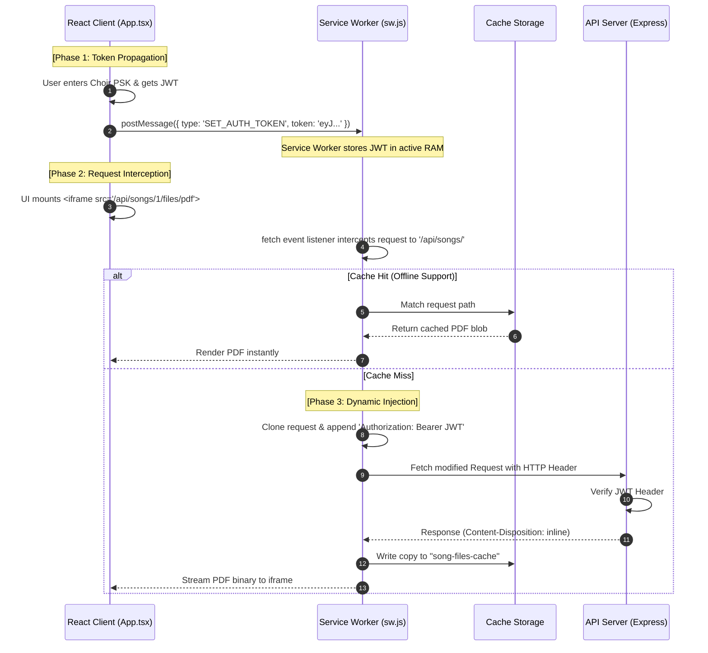

# Technical Guide: Service Worker Token Synchronization

This guide outlines the architectural design, implementation details, advantages, and drawbacks of **Service Worker Token Synchronization**. This pattern is designed to solve the security vulnerabilities of query-parameter-based authentication while supporting native HTML5 media and document streaming in Progressive Web Applications (PWAs).

---

## 1. Executive Summary & The Core Problem

In modern web applications, static assets such as documents (PDFs) and streaming audio/video (MP3, MP4) are rendered using native browser elements:
*   `<audio src="/api/songs/1/audio">`
*   `<video src="/api/songs/1/video">`
*   `<iframe src="/api/songs/1/pdf">`

Unlike standard API fetches (`fetch` or `Axios`), **native browser media and document requests do not allow developers to attach custom HTTP headers** (such as the standard `Authorization: Bearer <token>` header). 

This limitation leads many developers to use **Query-Parameter Authentication** (e.g., `/api/songs/1/audio?token=eyJ...`). However, as detailed in **ADR-057 Section 2.8**, passing credentials in the URL structure introduces severe security risks:
*   **Leakage in browser history** (retrievable by anyone with access to the client machine).
*   **Leakage in server-side access logs** (e.g., Traefik/Nginx logging the full URL including credentials).
*   **Leakage in Referer headers** sent to external third-party servers.

**Service Worker Token Synchronization** completely resolves this problem. By using a background Service Worker to intercept all outbound network fetches, we can dynamically inject the `Authorization` header inside the network layer, keeping our URLs perfectly clean and secure.

---

## 2. Architectural Comparison

To understand why this is the premier method for PWA environments, here is a comparison against other standard authentication strategies:

### A. Comparison Table

| Feature / Criteria | ❌ Query-Parameter Auth | ❌ Cookie-Based Auth | ❌ Pure LocalStorage Fetch |  Service Worker Sync |
| :--- | :--- | :--- | :--- | :--- |
| **Supports HTML5 Media Elements?** | **Yes** | **Yes** | **No** (Blocks native `src` requests) | **Yes** (Intercepts native `src` fetches) |
| **Safe from Browser History Leaks?**| No | Yes | Yes | **Yes** (URLs remain tokenless) |
| **Safe from Server Access Log Leaks?**| No | Yes | Yes | **Yes** (Auth headers are not logged) |
| **Safe from CSRF Attacks?** | Yes | No (Requires CSRF tokens) | Yes | **Yes** (XSS is the only surface area) |
| **Cross-Origin / Subdomain Safe?** | Yes | No (Complex across different clouds)| Yes | **Yes** (Supports multi-origin configurations) |
| **Works Offline?** | Yes | Yes | No | **Yes** (Perfect offline integration) |

### B. Detailed Comparison Details

*   **Why not Cookies?** While HttpOnly cookies are highly secure, they are vulnerable to **Cross-Site Request Forgery (CSRF)** and are notoriously difficult to configure in decentralized architectures where the frontend is hosted on a CDN (e.g., Netlify) and the backend API is hosted on a separate VPS or Kubernetes cluster (cross-origin cookie restrictions).
*   **Why not pure LocalStorage/SessionStorage fetches?** If you store your token in `localStorage`, you can easily attach it to API fetch calls. However, you **cannot** do this for `<audio src="...">` or `<iframe>` rendering. If you attempt to download files by fetching them as blobs in JavaScript, you lose the browser's native chunked streaming capabilities and overload the browser's thread for large audio/video payloads.

---

## 3. Deep-Dive Process Flow

The synchronization process flows in three distinct phases: **Token Propagation**, **Request Interception**, and **Dynamic Injection**.



---

## 4. Specific Code Implementation for MVET Songbook

Here is the exact codebase implementation blueprint required to transition the MVET Songbook from URL query tokens to the Service Worker Synchronization pattern.

### A. React Client Side (`src/hooks/useSongbookAuth.ts` or `src/songbook/App.tsx`)
When a user logs in (or when the PWA boots and reads the token from storage), we synchronize that state down to the active Service Worker:

```typescript
// src/utils/authSync.ts

/**
 * Synchronizes the user's active JWT token to the Service Worker thread
 */
export function syncTokenToServiceWorker(token: string | null) {
  if ('serviceWorker' in navigator) {
    navigator.serviceWorker.ready.then((registration) => {
      if (registration.active) {
        registration.active.postMessage({
          type: 'SET_AUTH_TOKEN',
          token: token
        });
        console.log('🔑 Securely synchronized token with background Service Worker.');
      }
    }).catch((err) => {
      console.error('❌ Failed to establish communication with Service Worker:', err);
    });
  }
}
```

> [!NOTE]
> Trigger `syncTokenToServiceWorker(token)` inside the React login handler, and `syncTokenToServiceWorker(null)` upon user logout to immediately scrub credentials from background memory.

---

### B. Service Worker Side (`src/sw.js` / Custom Workbox Script)
We configure our Service Worker to maintain an active in-memory token state and intercept all outgoing API requests.

```javascript
// src/sw.js
import { precacheAndRoute } from 'workbox-precaching';

precacheAndRoute(self.__WB_MANIFEST);

// Active authentication state held in background worker RAM
let activeJwtToken = null;

// 1. Listen for Token Synchronization Messages from the Main Thread
self.addEventListener('message', (event) => {
  if (event.data && event.data.type === 'SET_AUTH_TOKEN') {
    activeJwtToken = event.data.token;
    console.log('[SW] Auth Token synchronized in background context.');
  }
});

// 2. Fetch Interceptor for Secure API Requests
self.addEventListener('fetch', (event) => {
  const requestUrl = new URL(event.request.url);

  // Identify requests destined for our protected API resources
  if (requestUrl.pathname.includes('/api/songs/') && requestUrl.pathname.includes('/files/')) {
    
    // If we have an active token, dynamically inject it into the request headers
    if (activeJwtToken) {
      const headers = new Headers(event.request.headers);
      headers.set('Authorization', `Bearer ${activeJwtToken}`);

      // Reconstruct the request with the secure headers
      const secureRequest = new Request(event.request, {
        headers: headers,
        mode: 'cors', // Ensure cross-origin security context
        credentials: 'omit' // Let standard Bearer headers handle auth
      });

      event.respondWith(
        fetch(secureRequest).then((response) => {
          // If the server returns a 401/403, our token might have expired
          if (response.status === 401 || response.status === 403) {
            console.warn('[SW] Token authorization failed on server. Prompting re-auth.');
          }
          return response;
          return response;
        }).catch((err) => {
          console.error('[SW] Secure fetch network failure:', err);
          return caches.match(event.request); // Fallback to offline cache if net fails
        })
      );
    } else {
      console.warn('[SW] Attempted to fetch secure resource without active token.');
    }
  }
});
```

---

## 5. Pros and Cons Analysis

While Service Worker Token Synchronization represents the absolute pinnacle of security for client-rendered HTML5 PWAs, developers should understand its structural tradeoffs:

### Pros (Advantages)
1.  **Zero URL Exposure**: Eliminates JWT strings from browsing history, bookmark files, address bars, server access logs, and HTTP Referer trackers.
2.  **Supports Native HTML Elements**: The client simply sets `<audio src="/api/songs/Armed_Forces_Medley/files/mp3">` and the Service Worker injects the credentials under the hood. No heavy Javascript blob conversions are necessary.
3.  **Encapsulated Credentials**: The client DOM structure and standard anchor elements (`<a href="...">`) remain completely devoid of authentication payloads, keeping your frontend source tree safe from basic scrapers.
4.  **Automatic Offline Cache Integration**: Because the request intercepted is the *exact* URL mapped in Cache Storage, you maintain complete offline reliability without custom mapping layers.

### Cons (Drawbacks & Mitigations)
1.  **First-Load Lifecycle Delay**:
    *   *Issue*: On the very first visit, before the Service Worker is registered, activated, and takes control of the page, a request for a protected asset will fail because the SW isn't active to inject the header.
    *   *Mitigation*: Force the Service Worker to take immediate control of the client page on load by invoking `self.skipWaiting()` and `clients.claim()` during installation.
2.  **Worker State Volatility**:
    *   *Issue*: If the browser terminates the Service Worker thread to save resources (standard browser optimization), the local variable `activeJwtToken` in worker memory is cleared. When the SW wakes up, its memory is empty.
    *   *Mitigation*: Instead of keeping the token strictly in a local JavaScript variable (`activeJwtToken`), write the token into the browser's shared **IndexedDB** or read it from **LocalStorage** inside the Service Worker thread dynamically. (Since Service Workers can access IndexedDB directly, this guarantees persistence!).
3.  **Strict HTTPS Requirement**:
    *   *Issue*: Service Workers only operate in secure contexts (HTTPS). 
    *   *Mitigation*: This is already standard for the MVET Songbook since production runs natively under Traefik + Let's Encrypt TLS. (Vite also supports local execution on `localhost`).

---

## 6. Summary Strategy for MVET Songbook Release

For the upcoming roadmap, adopting this architecture ensures complete enterprise-grade security. Because **both the client PWA and the backend API namespace are already running fully containerized on Kubernetes and Netlify**, implementing this pattern will elevate the software context to the absolute highest architectural standard defined in **ADR-057**.
