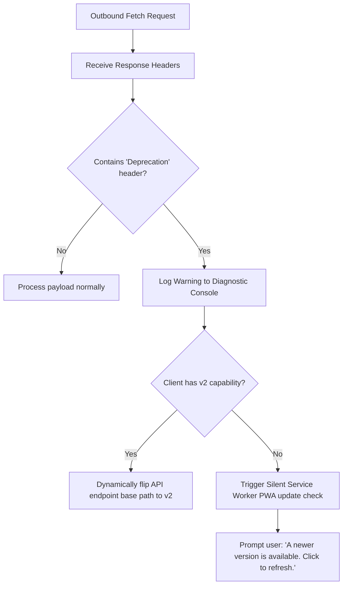

# MVET Songbook: API Versioning & Deprecation Strategy

This document establishes the architecture for tracking API version usage, signaling deprecation, and executing clean version decommissioning without breaking client PWAs.

---

## 1. Observability: Tracking Version Usage

To safely decommission an old API version (e.g., `v1`), we must have clear, verifiable metrics proving that active traffic has hit zero.

### Express Version Logging Middleware
We can implement a lightweight middleware on the Express backend that extracts the active version from the request path and logs it:

```typescript
// api/src/middleware/versionTracker.ts
import { Request, Response, NextFunction } from 'express';

export function versionTracker(req: Request, res: Response, next: NextFunction) {
  const match = req.originalUrl.match(/\/api\/(v\d+)\//);
  if (match) {
    const version = match[1];
    // In production, this can also log the User-Agent or Choir identifier
    console.log(`📊 [API-Access] Version: ${version} | Method: ${req.method} | Path: ${req.path}`);
  }
  next();
}
```

### Production Metrics (Prometheus / Grafana)
In a Kubernetes/K3s production context, we can expose these metrics via a Prometheus exporter:
*   **Metric Name:** `mvet_api_requests_total`
*   **Labels:** `{version="v1", method="GET", status="200"}`
*   **Alerting Rule:** Trigger an alert if `sum(rate(mvet_api_requests_total{version="v1"}[30d])) == 0` to confirm that the old version is completely dark and safe to remove from the router stack.

---

## 2. Deprecation Signaling: RFC 8594 Standard Headers

Rather than breaking an API version instantly, we signal deprecation transparently. We utilize the standardized HTTP headers defined in **RFC 8594** and **RFC 8631**:

| HTTP Header | Example Value | Description |
| :--- | :--- | :--- |
| **`Deprecation`** | `true` or `Sun, 27 May 2026 00:00:00 GMT` | Indicates that the resource has been deprecated and when the deprecation took effect. |
| **`Sunset`** | `Sun, 27 Nov 2026 23:59:59 GMT` | Declares the exact future date/time when the server will permanently shut down this endpoint. |
| **`Link`** | `<https://mvet.app/docs/migration-v2>; rel="deprecation"; type="text/html"` | Links to human-readable or machine-readable documentation describing the upgrade pathway. |

### Implementation on Backend
When a route under the deprecated `/api/v1` namespace is hit, the router automatically attaches these headers:

```typescript
// api/src/middleware/deprecationSignaling.ts
import { Request, Response, NextFunction } from 'express';

export function v1DeprecationSignaling(req: Request, res: Response, next: NextFunction) {
  res.setHeader('Deprecation', 'true');
  res.setHeader('Sunset', 'Thu, 31 Dec 2026 23:59:59 GMT');
  res.setHeader('Link', '<https://mvet.app/docs/api-v1-deprecation>; rel="deprecation"');
  next();
}
```

---

## 3. Intelligent Client-Side Adaptability

When our client-side PWA receives these deprecation signals in standard responses, it can adapt dynamically in three progressive layers:



### Layer A: Silent PWA Self-Updating
Upon detecting the `Deprecation` header, the PWA can instantly command the Workbox Service Worker to perform a silent background check for a fresh deployment (e.g. looking for a newer PWA bundle on GitHub Pages):

```typescript
// src/utils/deprecationCheck.ts
export function checkDeprecationHeaders(response: Response) {
  const isDeprecated = response.headers.get('Deprecation');
  const sunsetDate = response.headers.get('Sunset');

  if (isDeprecated) {
    console.warn(`⚠️ [API Warning] Utilizing deprecated API version. Sunset date scheduled: ${sunsetDate}`);
    
    // Command the Service Worker to check for new front-end PWA code updates
    if ('serviceWorker' in navigator) {
      navigator.serviceWorker.ready.then((registration) => {
        registration.update().then(() => {
          console.log('🔄 [PWA] Service Worker update check triggered successfully.');
        });
      });
    }
  }
}
```

### Layer B: Dynamic Version Negotiation
If our client is designed to support both `v1` and `v2` data shapes during the migration window, the client state manager can dynamically negotiate the latest active route base:

```typescript
// src/hooks/useVersionNegotiator.ts
import { useState } from 'react';

export function useVersionNegotiator() {
  const [apiVersion, setApiVersion] = useState<'v1' | 'v2'>('v1');

  const negotiateNewVersion = () => {
    console.log('🔄 [Negotiator] Dynamically switching client API pathing from v1 to v2...');
    setApiVersion('v2');
  };

  return { apiVersion, negotiateNewVersion };
}
```

### Layer C: Gentle User Banner Notification
If the local PWA cannot auto-negotiate, it displays a premium, non-obtrusive glassmorphic notification banner at the top of the interface:

> 🔔 **App Update Available**
>
> We have released a faster, more secure version of the rehearsal engine. [Click here to reload and update instantly].
