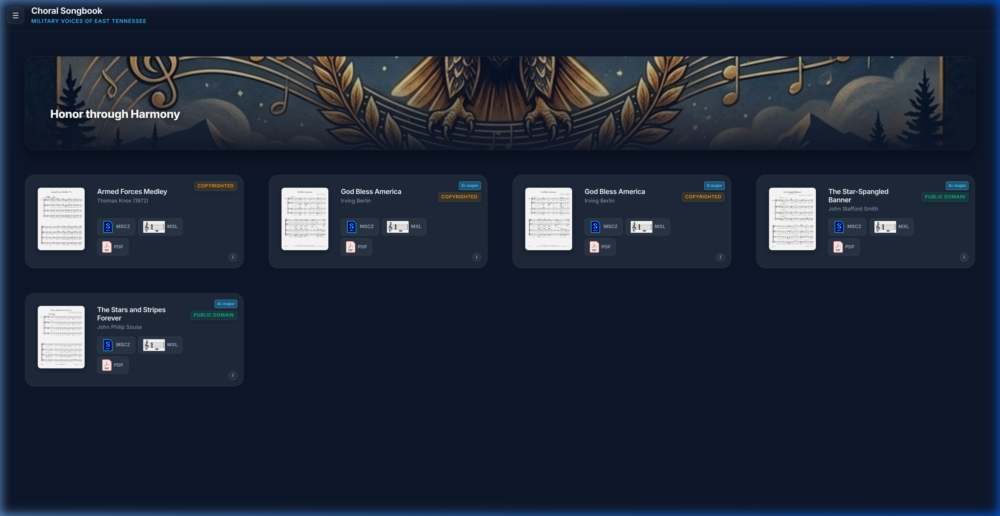
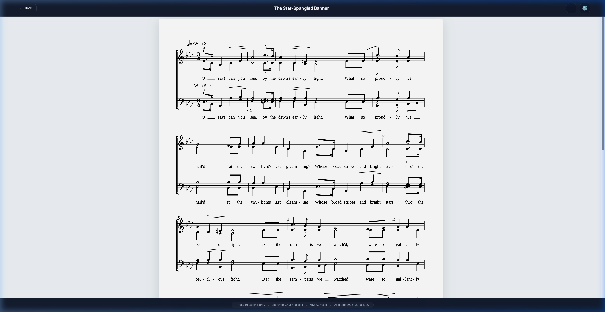
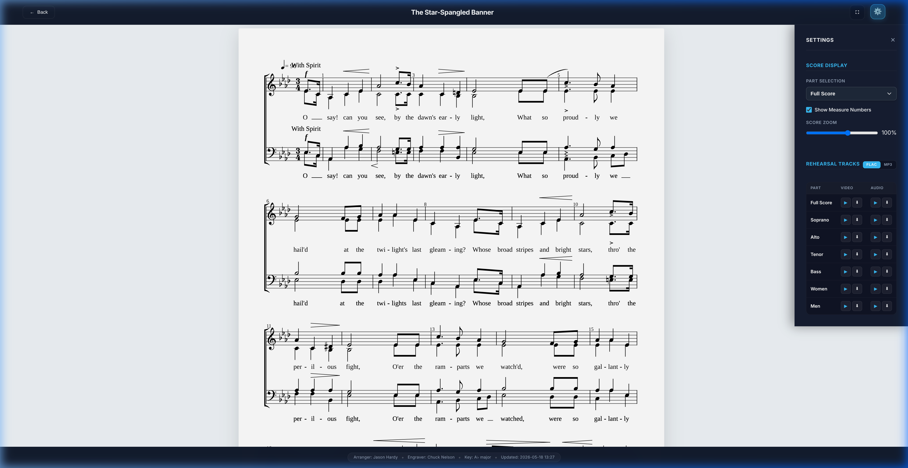
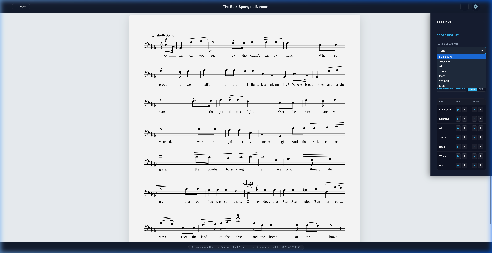
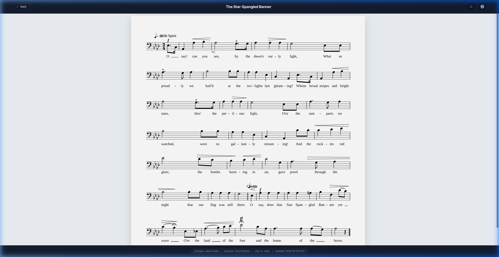
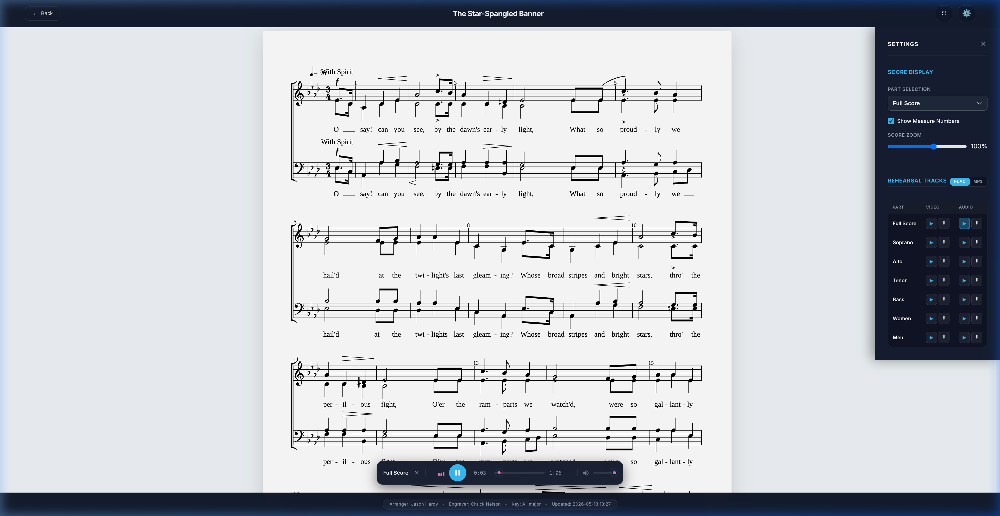

# 🎶 Military Voices of East Tennessee (MVET) Chorus User Guide

## _Guide to the Interactive Songbook & Rehearsal Suite_

Welcome to the **MVET Songbook**! This interactive rehearsing and performance application has been designed specifically for members of the Military Voices of East Tennessee (MVET) Chorus.

Whether you are rehearsing at home, practicing on the road, or performing live on stage, this application delivers high-fidelity sheet music, synchronized rehearsal tracks, and offline capability.

This guide will walk you through accessing, installing, unlocking, and mastering every single feature of the MVET Songbook.

---

## 🏛️ Step 1: Accessing the Application

To begin, open your web browser on your smartphone, tablet, or computer and navigate to the application link:
👉 **[https://chuck650.github.io/MVET_Songbook/](https://chuck650.github.io/MVET_Songbook/)**

Upon navigating, you will see the **Dashboard Home Catalog** showing all active songs in the choral library.

_Figure 1: The MVET Songbook Dashboard Home Catalog view, showing song library cards._

---

## 🔑 Step 2: Unlocking Copyrighted Music (Choir Access Key)

To respect musical copyright rules, secure audio rehearsals and certain licensed vocal arrangements are blocked. Copyrighted song cards display a dark **`COPYRIGHTED`** badge and are locked initially.

### How to enter your Choir Access Key:

1. Tap any song card displaying a **`COPYRIGHTED`** badge. A secure passcode window will slide up.
2. Alternatively, tap the **Gear Icon (Settings)** in the top-left corner of the dashboard screen to open the global settings panel.
3. Locate the **Choir Access Key** field.
4. Type or paste your private access key.
   _(If you do not have the access key, please contact **Jason Hardy or Chuck Nelson**, or retrieve it from the pinned announcements in our private Facebook Group: [Military Voices of East Tennessee (MVET)](https://www.facebook.com/groups/674760652211751))._
5. Tap **Submit Key** or **Save Settings**.
6. The entire song catalog will available instantly! All copyrighted works will be unblocked, and your download buttons (PDF, MSCZ, and MXL) will become active.

> [!TIP]
> **You only have to do this once!** The application securely stores this key in your browser's local cache. It will remember you automatically, even if you close the app, shut down your browser, or restart your device.

---

## 📲 Step 3: Installing the App (PWA Guide)

The MVET Songbook is built as a **Progressive Web App (PWA)**. Installing it bypasses the app stores entirely, adding a premium launch icon on your home screen or dock. It removes the browser address bars for a clean full-screen sheet music layout and enables offline singing. You can ue the browser of your choice. Instuctions for common OS and browser combinations are provided below.

### 📱 iOS Devices (iPhones and iPads)

> [!IMPORTANT]
> You must use the default **Safari** browser on iOS to install the app.

1. Open the Songbook link inside **Safari**.
2. Tap the **Share** button at the bottom of the screen (a square icon with an arrow pointing up).
3. Scroll down the sharing panel and tap **"Add to Home Screen"**.
4. Confirm by tapping **Add** in the top-right corner.
5. The **Choral Songbook** launcher icon will now be pinned to your home screen!

### 🤖 Android Devices (Phones and Tablets)

1. Open the Songbook link in **Google Chrome**.
2. Tap the **Three Dots** menu icon in the top-right corner.
3. Tap **"Install App"** (or **"Add to Home Screen"**).
4. Tap **Install** to confirm.
5. The app launcher icon is now ready on your device.

### 💻 Windows Laptops & Desktops

1. Open the link in **Google Chrome** or **Microsoft Edge**.
2. Look at the right side of the address bar at the top of the browser. You will see an **Install Icon** (it looks like a small monitor with a down arrow, or a cluster of squares with a plus sign).
3. Click this icon, then click **Install**.
4. A standalone desktop application window will launch, and a shortcut will be placed on your desktop.

### 🍏 MacBooks & Desktop Macs

1. Open the link inside **Safari** (macOS Sonoma or newer).
2. Click **File** in the top Mac menu bar.
3. Choose **"Add to Dock..."**.
4. Click **Add** to confirm.
5. The standalone application is now pinned to your Mac Dock!

---

## 🎼 Step 4: Loading & Viewing Sheet Music

Tap any unlocked song card on your dashboard (such as _The Star-Spangled Banner_) to load it into the sheet music viewer.

The sheet music viewer loads a premium high-contrast sheet music canvas. By default, the viewer displays the **Full Score** with symmetric left/right margins and professional automatic centering.

_Figure 2: The Interactive Sheet Music Viewer showing a full score._

---

## ⚙️ Step 5: Mastering Vocal Part Isolation & Settings

Inside the sheet music viewer, all layout preferences and rehearsal tracks are centralized inside the **Settings Drawer**.

### Opening the Settings Drawer:

- Click the **Gear (⚙️) button** in the top-right corner of the viewer header tools.
- The Settings Drawer will slide open from the right side of your screen.

_Figure 3: Sheet Music Viewer with the slide-out Settings Drawer open._

### 1. Score Display & Vocal Part Isolation

- **Vocal Part Selection:** Inside the Settings Drawer under **Score Display**, tap the **Part Selection** dropdown menu.
- By default, it is set to "Full Score". You can select your specific vocal line (_Soprano, Alto, Tenor, Bass, Men, or Women_).

_Figure 4: Selecting isolated vocal parts (e.g., Tenor) from the dropdown list._

- **Dynamic Re-rendering:** Once you select your part, the interactive engine instantly sweeps away all other staves, displaying **only your selected vocal line**! This keeps your score clean and eliminates tracking confusion.

_Figure 5: The sheet music viewer isolated to display only the Tenor vocal part staff._

- **Score Zoom Slider:** Want larger notes? Drag the **Score Zoom** slider inside the settings drawer to scale the notation staff dynamically from **30% up to 150%** of its original size. The notes will scale cleanly without stretching off the edges.
- **Show Measure Numbers:** Toggle the **Show Measure Numbers** checkbox to show or hide exact measure labels above the systems.

---

## 🔊 Step 6: Using Rehearsal Tracks & Players

Under the **Rehearsal Tracks** section of the Settings Drawer, you will find high-fidelity rehearsal guides matching the active song arrangement.

### 1. High-Fidelity Audio Tracks (FLAC & MP3)

1. Choose your preferred audio format (**FLAC** or **MP3**) via the toggle buttons.
2. The table lists all parts (_Full Score, Soprano, Alto, Tenor, Bass, etc._) that have guide tracks.
3. Tap the play (**▶**) button to listen to any track, or click the download (**⬇**) button to save the audio file directly to your hard drive.
4. Playing a track triggers our premium **Mini-Player Bar** at the bottom of the screen!

_Figure 6: Sheet Music Viewer with the Rehearsal Audio Player active at the bottom._

### 2. Audio Player Bar Controls:

- **Equalizer Visualizer:** A glowing three-bar visualizer reacts in real time to the audio's dynamic volume, proving that your track is active and playing.
- **Play / Pause:** Tap the center button (which changes from play to pause) to control playback. If a track is loading, a circular spinner will show.
- **Timeline Seeker:** Drag the timeline slider to jump forward or backward to specific parts of the song. Timeline clocks show current time and total song length.
- **Volume Slider:** Adjust the volume slider on the far right (with a speaker icon) to calibrate rehearsal volume.

---

## 🎥 Step 7: Synchronized Video Rehearsal

For singers who learn visually:

1. Open the Settings Drawer (⚙️) inside the score viewer.
2. In the Rehearsal Tracks table, locate the **Video** column.
3. Tap the play (**▶**) button for your part.
4. A high-definition **Video Modal Overlay** will open directly over the score viewer.
5. The video synchronizes to the guide track, and you can play, pause, or fullscreen the video easily.
6. Click the Close (**×**) button in the top-right of the video window to return immediately to your sheet music notation.

---

## ⛶ Step 8: Hands-Free Performance Mode (Music Stand View)

When you are performing live in concert or want a completely clean, distraction-free rehearsal layout:

### 1. Activating Performance Mode:

- Tap the **Fullscreen (⛶) button** in the top-right header tools.
- The application will enter pure fullscreen, hiding the header bars, sliders, sidebars, and settings drawer.

### 2. The Performance Layout:

- Your sheet music formats into a **single continuous horizontal staffline** that stretches across the entire screen.
- Viewport-proportional margins prevent any squishing, rendering the text and notes in maximum size and high resolution.

### 3. Hands-Free & Gesture Navigation:

- **Gestures:** Swipe or drag your finger left or right on the sheet music to slide smoothly between measures.
- **Navigation Pill:** A small, transparent **Navigation Pill** floats in the lower-middle of the screen containing visual left/right arrow buttons for simple measure stepping.
- **Keyboard Control:** If your device is connected to a keyboard or bluetooth page turner, press **Right Arrow, PageDown, or Space** to go forward, and **Left Arrow or PageUp** to go backward.
- **Exiting:** Tap the exit (**×**) button in the top-right corner or press the **Escape (Esc)** key to return to the standard viewer.

> [!NOTE]
> **Keep your hands on your binder!** In both standard and Performance Mode, the app requests a background **Screen Wake Lock**. Your device screen will remain fully awake and lit indefinitely while a song is open, meaning your device will never dim or shut off while you are performing or practicing!

---

## ✈️ Step 9: Syncing Library for Offline Performance

Poor cellular reception at the church or rehearsal hall is no longer a problem. The MVET Songbook allows you to sync the entire database, saving files directly to your PWA.

### How to Synchronize:

1. On the Dashboard Home screen, tap the **Gear Icon (Settings)** in the top-left corner.
2. Scroll to the **Offline Sync Engine** section.
3. Tap the **Sync Library** button.
4. The system will download all MusicXML sheet music, printable PDFs, FLAC/MP3 rehearsal audio guides, and metadata files. A progress bar will track the download.
5. Once completed, the engine status will show **"Synced"**.
6. **You can now toggle Airplane Mode on your phone or tablet!** You can disconnect from cellular service and Wi-Fi completely. The application, sheet music rendering, and high-fidelity audio tracks will load and play flawlessly without any internet connection.

---

## 📞 Need Help?

If you experience any issues or have questions regarding the application:

- **Choir Access Key / Arrangements:** Contact Choral Director **Jason Hardy** or app maintainer, **Chuck Nelson**.
- **Online Announcements & Discussion:** Visit our private Facebook Group at [Military Voices of East Tennessee (MVET)](https://www.facebook.com/groups/674760652211751).
