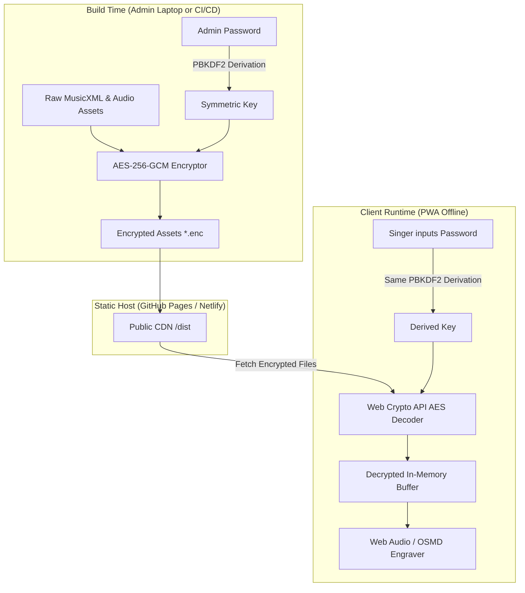
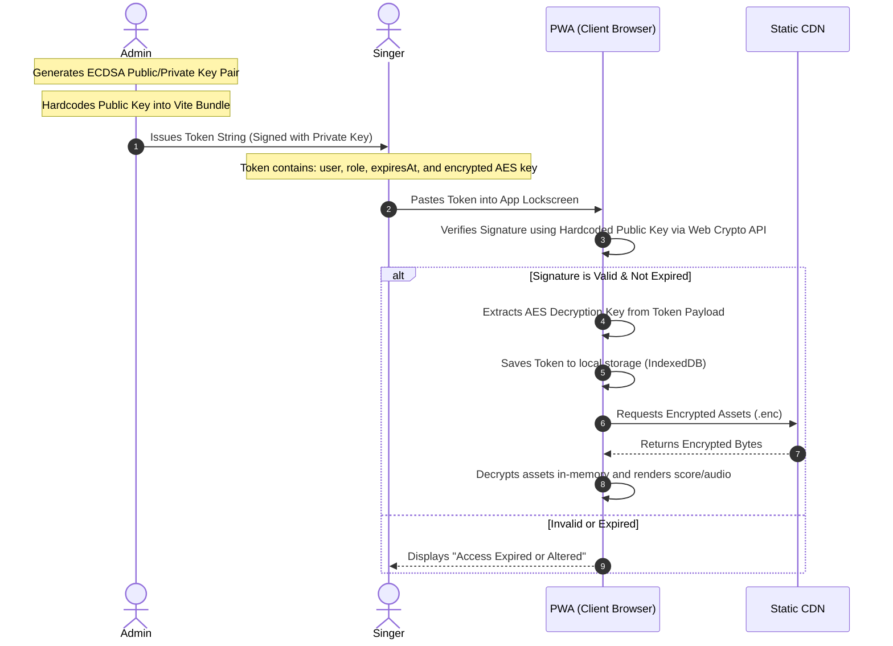

# Architectural Proposal: Cryptographic Access Control & Asset Encryption

This document presents a comprehensive research and planning proposal for securing the **MVET Songbook Rehearsal Suite** without introducing a server-side backend or database. It explores how a purely client-side, offline-first PWA hosted on public static platforms (like GitHub Pages or Netlify) can securely restrict app access and cryptographically protect underlying media assets (MusicXML, audio, video).

---

## 1. The Core Security Dilemma of Serverless PWAs

In a traditional web application, security is enforced at the server boundary: the server verifies a session cookie or JWT and rejects requests for static assets if unauthorized.

In a static, serverless architecture:

1. **Public Statically Hosted Assets**: Any file placed in the `public` folder of a Vite build is deployed to a public CDN. Even if the UI blocks unauthenticated users, the actual asset URLs (e.g., `/songs/God_Bless_America/God_Bless_America.mp3`) remain fully discoverable via source code analysis or browser network inspection.
2. **Offline-First Requirements**: Security checks must run 100% locally when a veteran singer is rehearsing in a church basement, military hanger, or outdoor pavilion without internet access.

To resolve this dilemma, we must transition from **boundary-based security** (gating URLs) to **cryptographic data-level security** (encrypting the files themselves).

---

## 2. Cryptographic Security Models

We propose three potential paths for securing the MVET Songbook, ranging from simple password locking to individual cryptographic key provisioning.

### Model A: Pre-Shared Symmetric Key (WEP-style "Rehearsal Password")

A single, shared passphrase is used by the entire chorus to unlock the application and decrypt assets.



#### How it works:

1. **Build-Time Encryption**: A local node script runs during the compilation phase. It takes a master passphrase (configured in a non-tracked local environment variable), derives a 256-bit symmetric key using PBKDF2 (with a unique salt), and encrypts all files under `/songs` using **AES-256-GCM**.
2. **Asset Deployment**: The unencrypted `.mp3`, `.mxl`, `.mp4`, and `songs.json` are excluded from the build. Only the encrypted `.enc` files (e.g. `songs.json.enc`, `song-SATB.mxl.enc`) are published to the web server.
3. **PWA Boot & Verification**: When the singer opens the app, they are presented with a premium, glassmorphic lock screen. They enter the passphrase.
4. **Key Derivation**: The browser uses the native **Web Crypto API** (`window.crypto.subtle`) to derive the key locally. It attempts to decrypt `songs.json.enc`.
   - **Success**: The metadata decodes. The key is saved in secure `sessionStorage` (or encrypted in `IndexedDB`).
   - **Failure**: Decryption fails, throwing a cryptographic integrity error. The UI rejects the password.
5. **Decryption at Playback**: When playing a track, the app fetches the encrypted chunks, decrypts them in-memory, and feeds them as a decrypted object URL or `ArrayBuffer` directly into the Web Audio API or OSMD.

---

### Model B: Asymmetric Signed Cryptographic Tokens (JWT-style)

Individual singers are issued unique, cryptographically signed tokens containing their identity, vocal part, and an expiration date.



#### How it works:

1. **Key Pair Generation**: The administrator generates a high-security asymmetric key pair (**ECDSA P-256** or **Ed25519**). The **Public Key** is compiled directly into the React/Vite source code. The **Private Key** is kept strictly secret by the administrator.
2. **Token Issuance**: The administrator uses a simple local script to generate a token for a user. The token is a JSON payload signed with the private key:
   ```json
   {
     "id": "token-084",
     "name": "Mary Smith",
     "part": "soprano",
     "expires": "2026-12-31T23:59:59Z",
     "masterKey": "Base64EncryptedAESKey..."
   }
   ```
3. **verification**: The user pastes this token string into the app. The Web Crypto API verifies the cryptographic signature against the hardcoded public key. If verified, the app unlocks.
4. **Hybrid Decryption**: The signed token payload contains the Master Symmetric Key (which was encrypted with the administrator's key). Once verified, the client extracts this key and uses it to decrypt the music files.

---

### Model C: Netlify Edge Gating (Hybrid CDN Auth)

A hybrid approach where authentication is validated at the serverless CDN edge, while the app retains offline-sync capabilities once unlocked.

#### How it works:

1. We utilize **Netlify Edge Functions** (lightweight Javascript workers running at the CDN level).
2. The song assets are stored behind an auth-gated path (e.g., `/secure/songs/...`).
3. When the client makes a request, the Edge Function intercepts it, verifies a header token or cookie, and either serves the raw file or returns `401 Unauthorized`.
4. Once authorized, the Service Worker caches the raw assets locally. The PWA operates 100% offline from that point forward.

---

## 3. Cryptographic & Operational Feature Matrix

| Security Dimension        | Model A: Shared WEP-style PSK                         | Model B: Signed Asymmetric Tokens                   | Model C: Edge Gating                               |
| :------------------------ | :---------------------------------------------------- | :-------------------------------------------------- | :------------------------------------------------- |
| **Backend / Server Code** | **None** (100% Static)                                | **None** (100% Static)                              | **Edge Functions** (No DB required)                |
| **Asset Security**        | **Excellent** (Files are fully encrypted on server)   | **Excellent** (Files are fully encrypted on server) | **Good** (Gated by CDN, but raw on CDN origin)     |
| **Offline Playback**      | **Flawless** (Decrypted locally)                      | **Flawless** (Decrypted locally)                    | **Flawless** (Once cached in PWA)                  |
| **User Revocation**       | **Hard** (Requires changing password & re-encrypting) | **Easy** (Expiry dates + optional revocation list)  | **Easy** (Dynamic verification)                    |
| **User Experience**       | **Simple** (Enter choir password once)                | **Moderate** (User must copy/paste personal token)  | **Seamless** (Standard login or cookie validation) |
| **Client Device Load**    | **Medium** (AES decryption in-memory)                 | **Medium** (Asymmetric signature + AES decryption)  | **None** (Browsers receive raw files)              |

---

## 4. Addressing Token Expiration & Revocation Offline

In an offline-first architecture, enforcing expiration and revocation poses unique mathematical and logical constraints.

### How to Expire Tokens Offline

1. **Cryptographic Expiration (Standard)**: The token (Model B) contains a signed `expires` timestamp. Because the signature is cryptographically verifiable, the client-side code can trust this timestamp completely. It compares it against the device's local clock. If `deviceTime > expires`, the app locks itself.
   - _Threat_: A user could manually roll back their device system clock to bypass expiration.
   - _Mitigation_: The PWA tracks a "high-water mark" timestamp in `IndexedDB`. Every time the app runs, it logs the current time. If the current system time is _earlier_ than the last logged time, the app detects clock tampering, immediately invalidates the token, and locks itself.

2. **Key Rotation (Model A & B)**:
   - Every year or concert season, the administrator regenerates the symmetric key, re-encrypts the files, and deploys.
   - Old tokens will not contain the new key, forcing singers to request the updated token for the new season.

### How to Revoke Tokens Without a Database

If a singer leaves the choir and their token needs to be invalidated before its hardcoded expiration:

1. **Public Cryptographic Revocation Lists (CRL)**:
   - The app maintains a lightweight JSON file on the server: `/public/revocation_list.json` containing hashes of revoked `tokenIds`.
   - When the user's device is online, it silently fetches this file and caches it.
   - If the user's local token ID appears in the list, the PWA immediately deletes all decrypted local songs and wipes the token.
   - Since this is a simple static JSON file, it requires no backend database and can be updated by the administrator in git.

---

## 5. Technical Implementation Details (Web Crypto API)

The modern web browser has highly optimized cryptographic operations built into the native assembly layer of the browser engine via **Web Crypto API**.

### Standard 256-bit Key Derivation (PBKDF2)

To convert a simple user password into a secure cryptographic key in the browser:

```javascript
async function deriveKey(passwordString, saltBytes) {
  const encoder = new TextEncoder();
  const baseKey = await window.crypto.subtle.importKey(
    "raw",
    encoder.encode(passwordString),
    "PBKDF2",
    false,
    ["deriveKey"],
  );

  return window.crypto.subtle.deriveKey(
    {
      name: "PBKDF2",
      salt: saltBytes,
      iterations: 100000,
      hash: "SHA-256",
    },
    baseKey,
    { name: "AES-GCM", length: 256 },
    false,
    ["decrypt"],
  );
}
```

### In-Memory Decryption of MusicXML/Audio Files

When fetching files, the app intercepts the binary data and decrypts it before feeding it to our layout engine (OSMD) or Web Audio node structure:

```javascript
async function decryptAsset(encryptedArrayBuffer, aesKey, iv) {
  try {
    const decryptedBuffer = await window.crypto.subtle.decrypt(
      {
        name: "AES-GCM",
        iv: iv, // Initialization vector prepended to the file
        tagLength: 128,
      },
      aesKey,
      encryptedArrayBuffer,
    );
    return decryptedBuffer; // Raw MXL string or MP3 bytes
  } catch (e) {
    console.error(
      "Cryptographic decryption failed: Invalid key or corrupted file.",
    );
    throw e;
  }
}
```

---

## 6. Recommended Next Steps for Research

If we decide to move forward with a security layer, we recommend exploring:

1. **Memory & Performance Audit**: Test AES-GCM decryption speeds in-browser for a large 10-minute MP4 video file on a 5-year-old Android/iOS device to ensure there is no rendering lag in "Performance Mode."
2. **Build-Time Script Prototyping**: Draft a Node.js utility script in `/scripts/encrypt-assets.js` that integrates into the Vite build process to encrypt designated song folders automatically before production deployment.
3. **UX Lockscreen Mockups**: Design a premium passcode screen featuring patriotic glassmorphism that prompts for the token/password in a highly aesthetic, user-friendly way suitable for older veterans.

---

> [!NOTE]
> All encryption and verification mechanisms discussed in this document use native browser capabilities. They do not require external npm cryptographic packages, keeping our bundle size lean and maintaining our strict standards of performance.

> [!IMPORTANT]
> Because this is a static site deployed on GitHub Pages / Netlify, true cryptographic security _must_ encrypt the assets. Simply hiding the UI behind a password block keeps out general users, but cannot prevent direct file downloading if the asset paths remain unencrypted.
