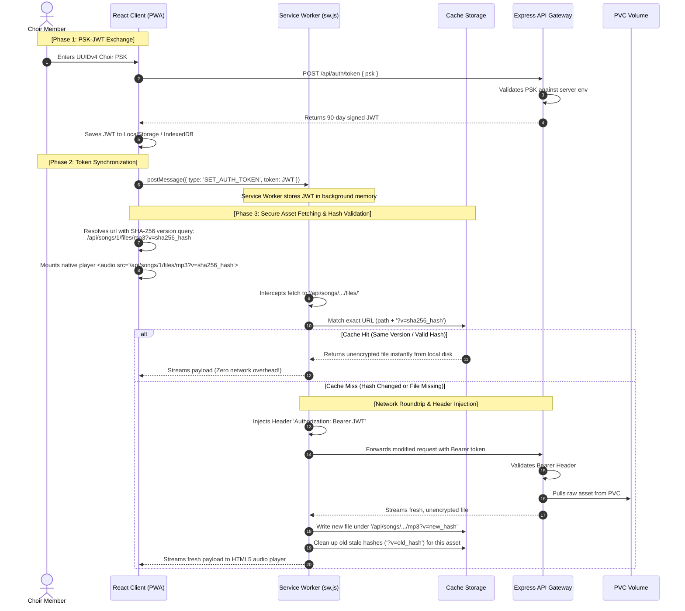

# Architectural Specification: Secure Token & Fetch Interceptor Architecture

This document specifies the target security architecture for the **MVET Songbook Rehearsal Suite**. It establishes a secure, standard-compliant communication contract between the React PWA Client and the stateless Express API gateway, completely eliminating authentication tokens from browser URLs.

---

## 1. Architectural Vision & Scope

The security model of the MVET Songbook relies on **API-level boundary gating**. The system protects copyrighted SATB vocal arrangements and rehearsal tracks from public extraction while ensuring absolute ease-of-use for veteran choir members.

### Core Principles
1.  **No File-Level Encryption**: Raw media assets (MusicXML, MSCZ, PDF, MP3) are stored unencrypted in the server's Kubernetes Persistent Volume Claim (PVC) and cached unencrypted in the browser's Cache Storage.
2.  **Stateless API Authorization**: The backend Express API serves as the secure gateway, verifying tokens and streaming the raw files to authorized requests.
3.  **Standard-Compliant Headers**: In compliance with **ADR-057 Section 2.8**, credentials must never pass via URL query strings. All secure communications must utilize the standard HTTP `Authorization` header.
4.  **Service Worker Fetch Interception**: A background Service Worker intercepts native media fetches (e.g., from `<audio>` and `<iframe>` elements) to dynamically inject the authorization header, enabling clean, tokenless client URLs.

---

## 2. Authentication & Data Life Cycle

The lifecycle of a choir member's session consists of exchanging a Pre-Shared Key (PSK) for a JSON Web Token (JWT) and accessing resources:



---

## 3. The Security Boundary Comparison

Transitioning credentials out of URL paths resolves multiple endpoint vulnerability surfaces:

| Risk Dimension | ❌ Query-Parameter Auth (`?token=eyJ...`) |  Fetch Interceptor Sync (`Authorization` Header) |
| :--- | :--- | :--- |
| **Network Security** | **Secure** (HTTPS TLS encrypts the query in transit). | **Secure** (HTTPS TLS encrypts headers in transit). |
| **Browser History** | **Vulnerable** (URLs are saved in local plain-text history). | **Secure** (Clean paths `/api/.../mp3` are logged without tokens). |
| **Server Ingress Logs** | **Vulnerable** (Traefik/Nginx record raw queries in plain text). | **Secure** (Headers are stripped from standard router logs). |
| **Referer Leakage** | **Vulnerable** (External links transmit full query strings). | **Secure** (Referer logs only show the host or tokenless path). |
| **Accidental Sharing** | **Vulnerable** (Users sharing standard links share credentials). | **Secure** (Shared links require independent authentication). |

---

## 4. Technical Implementation Blueprint

Implementing this architecture requires three integrated code modifications across the codebase.

### A. React Client Side (`src/utils/authSync.ts`)
Upon successful login or during application initialization, the React client pushes the active token down to the active Service Worker:

```typescript
/**
 * Pushes the JWT from the React application context into the Service Worker thread
 */
export function syncTokenToServiceWorker(token: string | null) {
  if ('serviceWorker' in navigator) {
    navigator.serviceWorker.ready.then((registration) => {
      if (registration.active) {
        registration.active.postMessage({
          type: 'SET_AUTH_TOKEN',
          token: token
        });
      }
    }).catch((err) => {
      console.error('[Client Auth Sync] Service Worker connection failed:', err);
    });
  }
}
```

---

### B. Service Worker Fetch Interceptor (`src/sw.js`)
The Service Worker acts as the client-side proxy. It captures messages from the React app and monitors all outbound secure asset fetches:

```javascript
let activeJwtToken = null;

// 1. Maintain the Token State in Worker Memory
self.addEventListener('message', (event) => {
  if (event.data && event.data.type === 'SET_AUTH_TOKEN') {
    activeJwtToken = event.data.token;
  }
});

// 2. Intercept Outbound Secure Asset Fetches
self.addEventListener('fetch', (event) => {
  const url = new URL(event.request.url);

  // Match secure files (PDFs, Audio, MusicXML, MSCZ)
  if (url.pathname.includes('/api/songs/') && url.pathname.includes('/files/')) {
    
    if (activeJwtToken) {
      // Clone headers and inject the standard Bearer credential
      const modifiedHeaders = new Headers(event.request.headers);
      modifiedHeaders.set('Authorization', `Bearer ${activeJwtToken}`);

      const authorizedRequest = new Request(event.request, {
        headers: modifiedHeaders,
        mode: 'cors',
        credentials: 'omit'
      });

      event.respondWith(
        fetch(authorizedRequest).then((response) => {
          if (response.status === 401 || response.status === 403) {
            console.warn('[SW Proxy] Access token rejected by API server.');
          }
          return response;
        }).catch((err) => {
          console.error('[SW Proxy] Fetch failed, attempting cache match:', err);
          return caches.match(event.request);
        })
      );
    }
  }
});
```

---

### C. Server Gateway Authorization (`api/src/index.ts`)
The Express API endpoint verifies standard HTTP headers instead of queries, unifying credentials verification:

```typescript
import { Request, Response, NextFunction } from 'express';
import jwt from 'jsonwebtoken';

export interface AuthenticatedRequest extends Request {
  user?: any;
}

/**
 * Standard HTTP Bearer Authorization Middleware
 */
export function authenticateToken(req: AuthenticatedRequest, res: Response, next: NextFunction) {
  const authHeader = req.headers['authorization'];
  const token = authHeader && authHeader.split(' ')[1];

  if (!token) {
    return res.status(401).json({ error: 'Access Denied: Missing Bearer Token.' });
  }

  jwt.verify(token, process.env.JWT_SECRET || 'secret', (err, user) => {
    if (err) {
      return res.status(403).json({ error: 'Access Denied: Invalid or Expired Token.' });
    }
    req.user = user;
    next();
  });
}
```

---

## 5. Offline Cache Reliability

Because assets are cached unencrypted in-browser, the Service Worker manages offline availability using standard Cache Storage interfaces:
*   **Identification**: Files are cached and retrieved using their clean, tokenless paths (e.g., `/api/songs/God_Bless_America/files/mp3?v=hash`), stripping out any runtime credentials. This ensures high cache hit ratios.
*   **Offline Validation**: When offline, the Service Worker skips network routing entirely and retrieves the raw unencrypted file instantly from cache storage, providing standard sheet music rendering and audio playback without connection checks.

---

## 6. Implementation Action Plan

Our development workflow for implementing this architecture remains strictly local to ensure 100% stability before merging to production:

1.  **Local API Refactoring**: Update `api/src/index.ts` to accept the standard Bearer header alongside legacy checks (backward compatibility).
2.  **PWA Client Integration**: Incorporate message dispatch sync in `useSongbookAuth.ts` and set up standard header interception in `sw.js` via Vite-PWA.
3.  **Local Testing in K3s**: Build, deploy, and execute integration checks inside the `k3s-local` development environment to verify that no files leak in URLs and that offline playback remains completely reliable.
