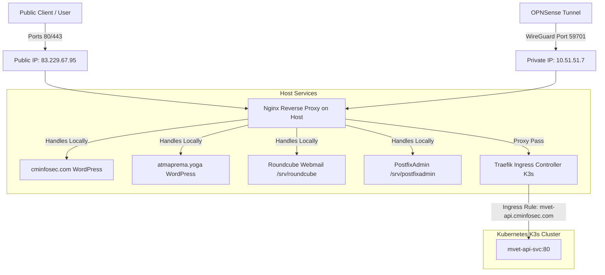

# 🖥️ Kamatera VPS Production Configuration & Environment Guide

This document provides a comprehensive overview of the active services, routing infrastructure, mail stack, and security protections running on the production Kamatera VPS server.

---

## 📊 1. System Hardware & Operating System Overview

*   **Operating System:** `Ubuntu 24.04.4 LTS` (Kernel: `6.8.0-71-generic`)
*   **CPU:** `Intel Xeon Processor (Sapphire Rapids)`
*   **RAM:** `4 GB` (3.8 GiB usable, swap disabled)
*   **Storage:** `20 GB SSD` (`/dev/sda2`, ~82% utilized)
*   **Host Name:** `mail.cminfosec.com`
*   **Networking:**
    *   **Public IP:** `83.229.67.95` (External internet access)
    *   **Private VPN IP:** `10.51.51.7` (WireGuard `wg0` tunnel mapped to local OPNSense gateway)

---

## 🌐 2. Network Topology & Ingress Routing

Requests from the internet navigate the stack through a multi-tier proxy architecture designed to isolate containerized services from the legacy web/mail sites:



### Ingress Specifications:
1.  **Nginx (Host OS):** Listens on port `80` and `443` on all interfaces (`0.0.0.0` and `[::]`).
    *   Directly handles and terminates SSL for:
        *   `www.cminfosec.com` & `cminfosec.com`
        *   `www.atmaprema.yoga` & `atmaprema.yoga`
        *   `mail.cminfosec.com` (Roundcube webmail client)
        *   `mail.atmaprema.yoga` (Roundcube webmail client)
        *   `postfixadmin.cminfosec.com` (PostfixAdmin panel)
        *   `mvet-api.cminfosec.com` (proxied internally)
2.  **Traefik Ingress (K3s Cluster):** Configured as a `ClusterIP` service inside K3s (IP: `10.43.237.79`, ports `80` and `443`).
    *   Bypasses external ports so it does not conflict with host-level Nginx.
    *   Receives requests forwarded from Nginx for `mvet-api.cminfosec.com`.

---

## 📧 3. Mail Infrastructure Configuration

The VPS runs a robust virtual mail hosting stack backing both `cminfosec.com` and `atmaprema.yoga`:

### Mail Routing Stack:
*   **MTA (SMTP Receiver/Sender):** `Postfix` (Ports `25` SMTP and `587` Submission).
*   **MDA/IMAP (Mailbox Store):** `Dovecot` (Port `143` IMAP and `993` IMAPS).
*   **Webmail Client:** `Roundcube` (Running in `/srv/roundcube/webmail/`).
*   **Mail Management:** `PostfixAdmin` (Running in `/srv/postfixadmin/public/`).
*   **Database Backend:** `Percona Server 8.0.45` (Stores virtual domains, aliases, and mailbox maps accessed via Postfix's MySQL proxy).

### SMTP Security Policies:
Baked directly into Postfix's [main.cf](file:///home/chuck/Projects/www/MVET_Songbook/docs/vps/backups/postfix_main.cf):
1.  **Transport Encryption:** TLS mandatory for outbound/inbound delivery (`smtpd_tls_security_level = may` supporting TLSv1.2 and TLSv1.3 only).
2.  **Authentication Rate Limits:** Protects against authentication flooding attacks:
    *   `smtpd_client_auth_rate_limit = 6`
    *   `smtpd_client_connection_count_limit = 5`
    *   `smtpd_client_connection_rate_limit = 25`
3.  **Spam Protections & Mail Filtering:**
    *   **Milters:** Postfix chains incoming mail through `OpenDKIM` (DKIM signatures), `OpenDMARC` (DMARC verification), and `SpamAssassin` (spam scoring).
    *   **SPF Enforcement:** Checks policy via `policyd-spf` daemon.
    *   **RBLs / DNSBLs:** Rejects connections listing in Spamhaus (`zen.spamhaus.org`, `dbl.spamhaus.org`) using custom `mua_recipient_restrictions`.
    *   **Sieve Filtering (Auto-Junk):** Dovecot LMTP loads the `sieve` plugin to parse incoming emails. A global sieve filter ([dovecot_global_default.sieve](file:///home/chuck/Projects/www/MVET_Songbook/docs/vps/backups/dovecot_global_default.sieve)) automatically intercepts emails flagged by SpamAssassin (with `X-Spam-Flag: YES` or `X-Spam-Status: Yes`) and routes them directly to the user's `Junk` folder.

---

## 🛡️ 4. Security, Firewall, and Intrusion Prevention

The VPS employs three defensive layers:

### A. Host Firewall: `nftables`
Configured via `/etc/nftables.conf` with a default policy of **DROP** on inbound/forward chains.
*   **Public Open Ports:**
    *   TCP `80`, `443` (Nginx Web traffic)
    *   TCP `25` (Inbound Mail)
    *   TCP `587` (SMTP Submission mail delivery)
    *   TCP `993` (IMAPS mailbox access)
    *   UDP `59701` (WireGuard endpoint)
    *   TCP `22` (SSH - rate-limited to 5 connections/sec to mitigate brute-forcing)
*   **Private VPN Open Ports (WireGuard Interface `wg0`):**
    *   TCP `9090` (Cockpit server management)
    *   TCP `5201` (iPerf3 bandwidth tester)
    *   TCP `6443` (Kubernetes API access)
*   **Container Bridges:** Explicitly allows forwarding to/from bridge interfaces `cni0` and `flannel.1`.

### B. Intrusion Prevention: `fail2ban`
Configured in `/etc/fail2ban/jail.local` with `banaction = nftables`. It actively parses system authentication logs to dynamically ban hostile IPs:
1.  **`sshd` Jail:** Bans IPs attempting unauthorized SSH logins.
2.  **`postfix-auth-fail` Jail:** Bans IPs attempting authentication brute-forcing on Postfix submission ports (maxretry: 3, findtime: 10m).
3.  **`dovecot` Jail:** Bans IPs attempting brute-force authorization on IMAPS / mail retrieval ports (enabled active monitoring).
4.  **Banned IPs Actions:** Directly injected as `reject` rules inside the `f2b-sshd` chain of the `nftables` inet table.

### C. SSL/TLS Certificate Engine: `Certbot`
Certbot manages Let's Encrypt certificates directly on the host using the Nginx configuration plug-in.
*   **Managed Domains:**
    *   `atmaprema.yoga` / `www.atmaprema.yoga`
    *   `cminfosec.com` / `www.cminfosec.com`
    *   `mail.atmaprema.yoga`
    *   `mail.cminfosec.com`
    *   `mvet-api.cminfosec.com`
*   **Auto-Renewal:** Regulated via a systemd timer that performs dry-run evaluations daily.

---

## 📂 5. Configuration Backups Repository

Backup copies of the essential configuration files collected from the VPS are saved in the project directory for emergency restoration:

*   **Nginx Configuration:**
    *   Main Config: [nginx.conf](file:///home/chuck/Projects/www/MVET_Songbook/docs/vps/backups/nginx.conf)
    *   Default vHost: [nginx_default](file:///home/chuck/Projects/www/MVET_Songbook/docs/vps/backups/nginx_default)
    *   Site Configs:
        *   [nginx_www.atmaprema.yoga](file:///home/chuck/Projects/www/MVET_Songbook/docs/vps/backups/nginx_www.atmaprema.yoga)
        *   [nginx_www.cminfosec.com](file:///home/chuck/Projects/www/MVET_Songbook/docs/vps/backups/nginx_www.cminfosec.com)
        *   [nginx_mail.atmaprema.yoga](file:///home/chuck/Projects/www/MVET_Songbook/docs/vps/backups/nginx_mail.atmaprema.yoga)
        *   [nginx_mail.cminfosec.com](file:///home/chuck/Projects/www/MVET_Songbook/docs/vps/backups/nginx_mail.cminfosec.com)
        *   [nginx_mvet-api.cminfosec.com](file:///home/chuck/Projects/www/MVET_Songbook/docs/vps/backups/nginx_mvet-api.cminfosec.com)
*   **Mail Configuration:**
    *   Postfix Main: [postfix_main.cf](file:///home/chuck/Projects/www/MVET_Songbook/docs/vps/backups/postfix_main.cf)
    *   Postfix Master: [postfix_master.cf](file:///home/chuck/Projects/www/MVET_Songbook/docs/vps/backups/postfix_master.cf)
    *   Dovecot Main: [dovecot.conf](file:///home/chuck/Projects/www/MVET_Songbook/docs/vps/backups/dovecot.conf)
    *   Dovecot LMTP config: [dovecot_20-lmtp.conf](file:///home/chuck/Projects/www/MVET_Songbook/docs/vps/backups/dovecot_20-lmtp.conf)
    *   Dovecot Sieve config: [dovecot_90-sieve.conf](file:///home/chuck/Projects/www/MVET_Songbook/docs/vps/backups/dovecot_90-sieve.conf)
    *   Global Sieve ruleset: [dovecot_global_default.sieve](file:///home/chuck/Projects/www/MVET_Songbook/docs/vps/backups/dovecot_global_default.sieve)
*   **Security & Firewall:**
    *   nftables Rules: [nftables.conf](file:///home/chuck/Projects/www/MVET_Songbook/docs/vps/backups/nftables.conf)
    *   fail2ban Jails: [fail2ban_jail.local](file:///home/chuck/Projects/www/MVET_Songbook/docs/vps/backups/fail2ban_jail.local)
    *   fail2ban OS Defaults: [fail2ban_defaults-debian.conf](file:///home/chuck/Projects/www/MVET_Songbook/docs/vps/backups/fail2ban_defaults-debian.conf)
*   **Mail Security & Milters:**
    *   OpenDKIM main config: [opendkim.conf](file:///home/chuck/Projects/www/MVET_Songbook/docs/vps/backups/opendkim.conf)
    *   OpenDKIM default: [default_opendkim](file:///home/chuck/Projects/www/MVET_Songbook/docs/vps/backups/default_opendkim)
    *   OpenDMARC main config: [opendmarc.conf](file:///home/chuck/Projects/www/MVET_Songbook/docs/vps/backups/opendmarc.conf)
    *   OpenDMARC default: [default_opendmarc](file:///home/chuck/Projects/www/MVET_Songbook/docs/vps/backups/default_opendmarc)
    *   SpamAssassin Local: [spamassassin_local.cf](file:///home/chuck/Projects/www/MVET_Songbook/docs/vps/backups/spamassassin_local.cf)
    *   SpamAssassin Milter default: [default_spamass-milter](file:///home/chuck/Projects/www/MVET_Songbook/docs/vps/backups/default_spamass-milter)
*   **WireGuard Tunnel:**
    *   wg0 Config: [wg0.conf](file:///home/chuck/Projects/www/MVET_Songbook/docs/vps/backups/wg0.conf)

---

## ⚙️ 6. Systemd Services & Timers

The system depends on several essential background daemons managed by `systemd` to keep business and API components online:

### Active Systemd Services:
*   `nginx.service`: Handles global inbound HTTP/HTTPS traffic.
*   `k3s.service`: Manages the local lightweight Kubernetes cluster (running the MVET Songbook API).
*   `mysql.service`: Runs the Percona Server backend database supporting virtual mail hosting.
*   `postfix@-.service`: Runs the Postfix MTA handler for sending/receiving mail.
*   `dovecot.service`: Handles IMAP mailbox retrieval and Dovecot SASL authentication.
*   `opendkim.service` & `opendmarc.service`: Milter processors for signing/verifying mail authenticity.
*   `spamd.service` & `spamass-milter.service`: Evaluates and filters inbound mail for spam.
*   `fail2ban.service`: Parses security log files and injects temporary bans into the firewall.

### Core Systemd Timers:
*   `certbot.timer`: Executes `certbot.service` twice daily to automatically renew Let's Encrypt certificates.
*   `spamassassin-maintenance.timer`: Runs daily updates to fetch fresh SpamAssassin spam filter heuristics.
*   `phpsessionclean.timer`: Runs every 30 minutes to garbage-collect stale PHP session folders.

---

## 🏷️ 7. Authoritative DNS Configuration (GoDaddy)

The domains `cminfosec.com` and `atmaprema.yoga` rely on external GoDaddy DNS records for security verification, SPF authorization, DKIM validation, and DMARC enforcement:

### A. MX Records (Inbound Mail Routing)
Both domains redirect email requests to the VPS mail server:
```text
cminfosec.com.       3600  IN  MX  10 mail.cminfosec.com.
atmaprema.yoga.      3600  IN  MX  10 mail.cminfosec.com.
```

### B. SPF Records (IP Address Authorization)
Declares the VPS external IP and designated MX entries as authorized senders to prevent impersonation:
```text
cminfosec.com.       3600  IN  TXT "v=spf1 ip4:83.229.67.95 mx ~all"
atmaprema.yoga.      3600  IN  TXT "v=spf1 ip4:83.229.67.95 mx ~all"
```

### C. DKIM Records (Cryptographic Message Signing)
Defines the public keys (selector `default`) used to verify signature headers added to outgoing mail by `OpenDKIM`:
*   **Host/Name:** `default._domainkey.cminfosec.com.`
    *   **Value:** `"v=DKIM1; h=sha256; k=rsa; p=MIIBIjANBgkqhkiG9w0BAQEFAAOCAQ8AMIIBCgKCAQEAhmR5LFNRVebzF7TNGSRKIqF0i4wOV1E4cTG5kVP3i3+1zIer7x035ffkXlDmAT1cuAXWNGmUZ+6311eB5cOKRCNATuVc4kqFWPm/mqyP+k2AnN5h2uw4Gb15lx/M+WSUtW5106bxPRqMc2hVNvyeHnPw+Hxq78C9pCWPOZQUY81aLCi46ESPk2j8xr+XajKzWT5SaIa9fbqBXkanGz+wPqmQzLUb718OFgLbzpdw4l+RvcbxSkNLx+huUZiqP5gZhdA2FSVDtaQlRBCaJwgT3RYsXAE2wY589Ogs/IuuZCKYYngUHjfYaKFdmOuhx9X9KkuGVmlHVQ1kYPNR4DaJQwIDAQAB"`
*   **Host/Name:** `default._domainkey.atmaprema.yoga.`
    *   **Value:** `"v=DKIM1; h=sha256; k=rsa; p=MIIBIjANBgkqhkiG9w0BAQEFAAOCAQ8AMIIBCgKCAQEAzg+hNd0etToMDaN/avwsLf8+5ITbnJUJeYvBhpkgoOMiLLk1ehMdEt4xim03cE9Q+M1rQ6E/6K29HgNW9qpcxT3njutLLCaNerWyb0r+zAifurPbmwcGVOL3sJwoabMZM0RzhhgIueLp2muHrTHVXjmYN3HBFkbS32CTVshtfxVRUAzxQbwkozVstt9ScPRb+yq8pJjpTWH7nGP3P3S/wkUERnzsjRGqqHLo5vuaxt2Rbx6OoEcaPgEkY9PWDFlu5HAbKjPWmHYeSIFTRpLW5Oi0kF8EQlV/GQrvih4o9CSAU2VquncbqkDUjZkFMHTbn4r25xkWbWCLSgdoJ3AD8QIDAQAB"`

### D. DMARC Records (Policy Enforcement)
Tells recipient mail systems to quarantine messages that fail SPF/DKIM check validations and routes aggregated XML reports:
*   **Host/Name:** `_dmarc.cminfosec.com.`
    *   **Value:** `"v=DMARC1; p=quarantine; rua=mailto:postmaster@cminfosec.com"`
*   **Host/Name:** `_dmarc.atmaprema.yoga.`
    *   **Value:** `"v=DMARC1; p=quarantine; rua=mailto:postmaster@atmaprema.yoga"`

